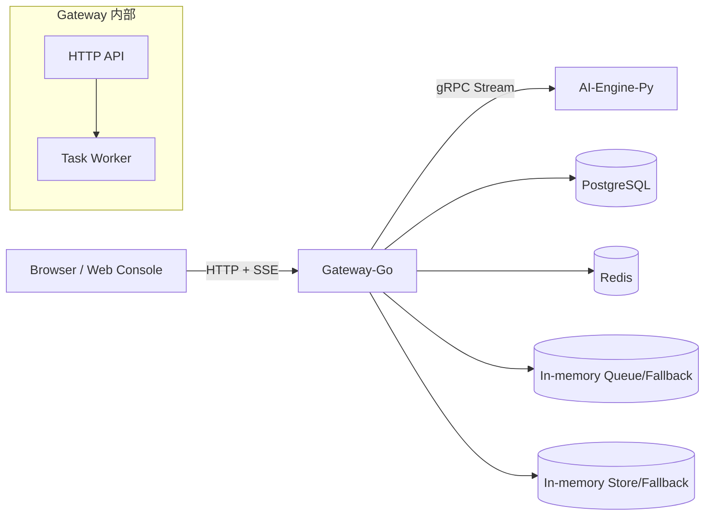

# Synapse

Synapse 是一个面向 Agent 任务执行的全栈示例工程，核心目标是把“任务提交 -> 异步执行 -> 流式回传 -> 可观测运维”串成一条完整闭环。

项目由三大运行时组件组成：

1. Web 控制台（React + Vite）
2. Gateway（Go + HTTP API + Worker）
3. AI Engine（Python + gRPC + OpenAI-compatible Runtime）

在默认配置下，项目提供：

1. 用户注册/登录（Cookie Session）
2. 任务创建、查询、流式事件订阅
3. 单任务取消、批量取消
4. 失败任务死信与重放
5. 多模型提供方接入（OpenAI / Gemini(OpenAI兼容) / 智谱(OpenAI兼容) / Mock）
6. 会话上下文拼接与持久化对话体验

---

## 一、项目定位与关键能力

### 1.1 适合什么场景

1. 需要一个可运行的 Agent 控制平面原型
2. 需要演示任务队列 + 流式输出 + 可取消 + 重试 + 死信
3. 需要验证多家模型供应商的 OpenAI-compatible 统一接入
4. 需要给前后端/多语言协作提供一致的协议边界（Proto + gRPC）

### 1.2 当前已实现能力

1. 任务生命周期：queued -> running -> completed/failed/canceled
2. SSE 事件实时推送，支持 last_event_id 断点续传
3. Worker 有界重试 + 死信记录 + 重放
4. 会话级上下文构建（最近轮次拼接）
5. 网关权限控制：普通用户仅可见自己的任务，管理员可全局运维

---

## 二、整体架构



核心链路（简化）：

1. 前端调用 POST /v1/tasks 创建任务
2. Gateway 落库任务（queued）并入队
3. Worker 出队后调用 AI Engine.SubmitTask（gRPC 流）
4. AI Engine 按 token 输出事件，Gateway 持久化事件
5. 前端通过 GET /v1/tasks/{taskID}/events SSE 获取增量事件
6. 任务失败时进入死信，可由运维台 replay

---

## 三、目录结构与模块说明

## 3.1 顶层目录

| 目录/文件 | 作用 |
| --- | --- |
| [apps/web](apps/web) | 前端控制台（用户视图 + 运维视图） |
| [services/gateway-go](services/gateway-go) | 网关 API、任务编排、队列消费、存储抽象 |
| [services/ai-engine-py](services/ai-engine-py) | 模型运行时与 gRPC 服务 |
| [proto/synapse/v1/agent.proto](proto/synapse/v1/agent.proto) | 跨语言协议定义（Go/Python 共享） |
| [scripts/dev.ps1](scripts/dev.ps1) | Windows 下统一开发入口脚本 |
| [scripts/post_gen.py](scripts/post_gen.py) | Proto 生成后补齐 Python 包初始化文件 |
| [docker-compose.yml](docker-compose.yml) | 全栈容器编排（gateway + ai-engine + postgres + redis） |
| [docker-compose.openai.env.example](docker-compose.openai.env.example) | OpenAI 配置模板 |
| [docker-compose.gemini.env.example](docker-compose.gemini.env.example) | Gemini(OpenAI兼容) 配置模板 |
| [docker-compose.zhipu.env.example](docker-compose.zhipu.env.example) | 智谱(OpenAI兼容) 配置模板 |
| [docker-compose.mirror.env.example](docker-compose.mirror.env.example) | 镜像源加速模板（网络受限） |
| [Makefile](Makefile) | 类 Unix 环境常用命令入口（proto/gateway/ai/web/up/down） |

## 3.2 Gateway（Go）模块拆解

### 入口与装配

关键文件：

1. [services/gateway-go/cmd/server/main.go](services/gateway-go/cmd/server/main.go)

启动时完成：

1. 加载配置
2. 连接 AI Engine gRPC
3. 初始化存储（Postgres 优先，失败回退内存）
4. 初始化队列（Redis 优先，失败回退内存）
5. 启动 Worker 消费循环
6. 启动 HTTP Server 与优雅退出流程

### 配置

关键文件：

1. [services/gateway-go/internal/config/config.go](services/gateway-go/internal/config/config.go)

主要环境变量：

1. SYNAPSE_HTTP_ADDR（默认 :8080）
2. SYNAPSE_AI_ENGINE_ADDR（默认 127.0.0.1:50051）
3. SYNAPSE_DATABASE_URL（启用 Postgres）
4. SYNAPSE_REDIS_ADDR（启用 Redis 队列）
5. SYNAPSE_TASK_MAX_ATTEMPTS / SYNAPSE_TASK_RETRY_BACKOFF / SYNAPSE_TASK_EXEC_TIMEOUT
6. SYNAPSE_AUTH_ADMIN_USERNAME / SYNAPSE_AUTH_ADMIN_PASSWORD

### API 层

关键文件：

1. [services/gateway-go/internal/api/router.go](services/gateway-go/internal/api/router.go)

路由包括：

1. 认证：/v1/auth/register, /v1/auth/login, /v1/auth/logout, /v1/auth/me
2. 任务：/v1/tasks, /v1/tasks/{taskID}, /v1/tasks/{taskID}/cancel, /v1/tasks/cancel, /v1/tasks/{taskID}/replay
3. 事件流：/v1/tasks/{taskID}/events
4. 运维：/v1/dead-letters
5. 健康：/healthz

### 任务处理与上下文能力

关键文件：

1. [services/gateway-go/internal/api/handlers.go](services/gateway-go/internal/api/handlers.go)

核心职责：

1. CreateTask 时校验权限、落库、入队
2. 对话模式下构建 conversation_id + user_message 元数据
3. 从历史任务与事件重建最近上下文，生成 model_prompt 与 model_messages_json
4. SSE 按 last_event_id 增量回放，终态发送 terminal 事件
5. 统一取消语义（首次 202、重复取消 200、终态冲突 409）

### 认证与权限

关键文件：

1. [services/gateway-go/internal/api/handlers_auth.go](services/gateway-go/internal/api/handlers_auth.go)

机制：

1. bcrypt 密码哈希
2. Cookie Session（HttpOnly, SameSite=Lax）
3. admin/user 双角色
4. 管理员账号在启动时自动 upsert

### Worker 执行引擎

关键文件：

1. [services/gateway-go/internal/worker/processor.go](services/gateway-go/internal/worker/processor.go)

核心行为：

1. 出队 -> SubmitTask(gRPC 流) -> 持久化事件
2. 有界重试（可配置 max attempts + backoff）
3. 部分错误判定为不可重试（DeadlineExceeded、Unauthorized 等）
4. 重试耗尽进入死信
5. 运行中可被 API 主动取消

### 队列抽象

接口：

1. [services/gateway-go/internal/queue/queue.go](services/gateway-go/internal/queue/queue.go)

实现：

1. [services/gateway-go/internal/queue/inmemory.go](services/gateway-go/internal/queue/inmemory.go)
2. [services/gateway-go/internal/queue/redis.go](services/gateway-go/internal/queue/redis.go)

### 存储抽象

接口：

1. [services/gateway-go/internal/store/store.go](services/gateway-go/internal/store/store.go)

实现：

1. [services/gateway-go/internal/store/inmemory.go](services/gateway-go/internal/store/inmemory.go)
2. [services/gateway-go/internal/store/postgres.go](services/gateway-go/internal/store/postgres.go)

说明：

1. Postgres 侧自动建表：tasks / task_events / dead_letter_tasks / auth_users / auth_sessions

### 协议与 AI 客户端

1. [services/gateway-go/internal/agent/client.go](services/gateway-go/internal/agent/client.go)
2. [services/gateway-go/internal/gen/synapse/v1](services/gateway-go/internal/gen/synapse/v1)

## 3.3 AI Engine（Python）模块拆解

### 入口与配置

关键文件：

1. [services/ai-engine-py/app/main.py](services/ai-engine-py/app/main.py)
2. [services/ai-engine-py/app/config.py](services/ai-engine-py/app/config.py)

说明：

1. 提供方参数统一从环境变量读取，支持超时与重试控制

### Runtime 核心

关键文件：

1. [services/ai-engine-py/app/runtime.py](services/ai-engine-py/app/runtime.py)

功能要点：

1. mock 模式：本地无外部依赖即可流式返回
2. openai 模式：直接走标准库 urllib（无 OpenAI SDK 依赖）
3. 支持 SSE stream=true 增量解析
4. stream 不可用时，自动降级普通 completion（仅在未收到任何 chunk 时）
5. HTTP 429/5xx、网络错误带重试与回退
6. 支持 model_messages_json 元数据直传多轮消息

### gRPC 服务门面

关键文件：

1. [services/ai-engine-py/app/service.py](services/ai-engine-py/app/service.py)

对外暴露：

1. Health
2. SubmitTask（started/token/completed/failed 事件流）

### Python Proto 生成物

1. [services/ai-engine-py/synapse/v1/agent_pb2.py](services/ai-engine-py/synapse/v1/agent_pb2.py)
2. [services/ai-engine-py/synapse/v1/agent_pb2_grpc.py](services/ai-engine-py/synapse/v1/agent_pb2_grpc.py)

## 3.4 Web（React）模块拆解

### 入口与构建

关键文件：

1. [apps/web/src/main.tsx](apps/web/src/main.tsx)
2. [apps/web/package.json](apps/web/package.json)
3. [apps/web/vite.config.ts](apps/web/vite.config.ts)

说明：

1. 开发代理把 /v1 与 /healthz 转发到 127.0.0.1:8080

### 页面逻辑

关键文件：

1. [apps/web/src/App.tsx](apps/web/src/App.tsx)

主要能力：

1. 登录/注册/退出
2. 客户端视图（会话列表 + 聊天流）
3. 运维视图（任务列表、状态筛选、批量取消、死信重放、SSE 事件窗口）
4. 本地持久化：语言、视图模式、会话身份摘要
5. SSE 游标缓存与去重，避免重复渲染 token

---

## 四、协议定义（Proto）

核心协议在 [proto/synapse/v1/agent.proto](proto/synapse/v1/agent.proto)。

### 4.1 gRPC 服务

1. Health(HealthRequest) returns HealthResponse
2. SubmitTask(SubmitTaskRequest) returns stream AgentEvent

### 4.2 事件类型

1. STARTED
2. TOKEN
3. INFO
4. COMPLETED
5. FAILED

Gateway 会把枚举转为小写字符串，统一到 HTTP/SSE 事件语义层。

---

## 五、技术栈总览

| 技术/框架 | 版本 | 用途 |
| --- | --- | --- |
| Go | 1.25.0 | Gateway 服务、HTTP API、Worker 执行逻辑 |
| net/http | Go 标准库 | 提供 REST API 与 SSE 事件流接口 |
| gRPC | 1.76.0 | Gateway 与 AI Engine 之间的服务通信 |
| Protocol Buffers | proto3 | 跨语言协议定义与代码生成 |
| PostgreSQL | 16 (alpine) | 任务、事件、会话、死信等核心数据持久化 |
| Redis | 7 (alpine) | 任务队列后端（可回退内存队列） |
| Python | 3.12 (slim) | AI Engine 运行时与模型适配逻辑 |
| grpcio / grpcio-tools | 1.76.0 | Python gRPC 服务与 Proto 代码生成 |
| urllib (Python stdlib) | Python 标准库 | OpenAI-compatible HTTP 请求与 SSE 解析 |
| React | 19.2.4 | Web 控制台 UI 构建（用户端与运维端） |
| TypeScript | 5.9.3 | 前端类型系统与工程可维护性 |
| Vite | 8.0.1 | 前端开发服务器与构建工具 |
| EventSource | 浏览器标准 | 前端订阅任务 SSE 增量事件 |
| Docker Compose | v2+ | 多服务本地编排与一键启动 |

---

## 六、如何启动（详细）

本节分为三种方式：

1. 全栈 Docker 启动（推荐）
2. 指定模型提供方启动（OpenAI/Gemini/智谱）
3. 本地分组件启动（适合调试）

## 6.1 前置环境

至少准备：

1. Docker Desktop（推荐）
2. PowerShell（Windows）
3. Node.js 18+（若要本地运行前端）
4. Go 1.25+（若要本地运行网关）
5. Python 3.12+（若要本地运行 AI 引擎）
6. protoc（若要本地重新生成 proto 代码）

## 6.2 方式 A：全栈 Docker 快速启动（Mock 默认）

在仓库根目录执行：

```powershell
docker compose up --build -d
```

或使用脚本入口：

```powershell
.\scripts\dev.ps1 -Task up
```

访问地址：

1. Web: http://127.0.0.1:5173（若前端本地 dev）
2. Gateway API: http://127.0.0.1:8080
3. AI Engine gRPC: 127.0.0.1:50051
4. Postgres: 127.0.0.1:5432
5. Redis: 127.0.0.1:6379

停止：

```powershell
docker compose down
# 或
.\scripts\dev.ps1 -Task down
```

## 6.3 方式 B：按模型提供方启动（推荐真实联调）

### OpenAI

1. 复制模板：

```powershell
Copy-Item docker-compose.openai.env.example docker-compose.openai.env
```

2. 编辑 [docker-compose.openai.env](docker-compose.openai.env) 填写真实 API Key
3. 启动：

```powershell
.\scripts\dev.ps1 -Task up-openai
```

### Gemini（OpenAI-compatible）

1. 复制模板：

```powershell
Copy-Item docker-compose.gemini.env.example docker-compose.gemini.env
```

2. 编辑 [docker-compose.gemini.env](docker-compose.gemini.env)
3. 启动：

```powershell
.\scripts\dev.ps1 -Task up-gemini
```

### 智谱（OpenAI-compatible）

1. 复制模板：

```powershell
Copy-Item docker-compose.zhipu.env.example docker-compose.zhipu.env
```

2. 编辑 [docker-compose.zhipu.env](docker-compose.zhipu.env)
3. 启动：

```powershell
.\scripts\dev.ps1 -Task up-zhipu
```

### 网络受限场景（镜像源 + 智谱）

```powershell
.\scripts\dev.ps1 -Task up-zhipu-mirror
```

该命令会同时加载：

1. [docker-compose.mirror.env](docker-compose.mirror.env)
2. [docker-compose.zhipu.env](docker-compose.zhipu.env)

说明：所有 provider 启动方式都会通过 docker compose --env-file 注入变量，避免修改主编排文件。

## 6.4 方式 C：本地分组件启动（调试友好）

### 步骤 1：生成 Proto 代码

```powershell
.\scripts\dev.ps1 -Task proto
```

可拆分执行：

```powershell
.\scripts\dev.ps1 -Task proto-go
.\scripts\dev.ps1 -Task proto-py
```

### 步骤 2：启动依赖（可选）

如果你希望使用持久化和分布式队列，先启动 Postgres/Redis。若不启动，Gateway 会自动回退到内存实现。

### 步骤 3：分别启动服务（建议 3 个终端）

终端 A（AI 引擎）：

```powershell
.\scripts\dev.ps1 -Task ai
```

终端 B（Gateway）：

```powershell
.\scripts\dev.ps1 -Task gateway
```

终端 C（Web）：

```powershell
.\scripts\dev.ps1 -Task web
```

### 步骤 4：访问前端

打开：http://127.0.0.1:5173

## 6.5 前端单独启动

```powershell
Set-Location apps/web
npm install
npm run dev
```

生产构建：

```powershell
npm run build
```

---

## 七、默认账号与认证说明

1. 管理员账号在 Gateway 启动时自动写入
2. 默认管理员用户名：admin
3. 默认管理员密码：123456
4. 生产环境请务必通过环境变量覆盖：
5. SYNAPSE_AUTH_ADMIN_USERNAME
6. SYNAPSE_AUTH_ADMIN_PASSWORD

认证机制简述：

1. 注册时密码 bcrypt 哈希存储
2. 登录后返回 HttpOnly Cookie（synapse_session_token）
3. API 层按角色校验资源访问权限

---

## 八、接口清单（HTTP）

### 8.1 健康检查

1. GET /healthz

### 8.2 认证

1. POST /v1/auth/register
2. POST /v1/auth/login
3. POST /v1/auth/logout
4. GET /v1/auth/me

### 8.3 任务与运维

1. GET /v1/tasks
2. POST /v1/tasks
3. GET /v1/tasks/{taskID}
4. POST /v1/tasks/{taskID}/cancel
5. POST /v1/tasks/cancel
6. POST /v1/tasks/{taskID}/replay
7. GET /v1/tasks/{taskID}/events
8. GET /v1/dead-letters

---

## 九、事件流与状态机

## 9.1 任务状态

1. queued
2. running
3. completed
4. failed
5. canceled

## 9.2 常见 SSE 事件

1. info
2. started
3. token
4. cancel_requested
5. canceled
6. completed
7. failed
8. dead_lettered
9. replay_requested
10. terminal

## 9.3 取消语义（非常重要）

1. queued/running 首次取消：202 Accepted
2. 已取消再次取消：200 OK（幂等）
3. completed/failed 取消：409 Conflict

---

## 十、创新点（当前项目最有价值的设计）

### 10.1 OpenAI-compatible 统一接入层

1. 在 Python Runtime 里以 openai 作为统一传输通道
2. 通过 base_url + model 即可切换 OpenAI/Gemini/智谱
3. provider_alias 让健康检查可展示语义供应商名称
4. 避免每个供应商做一套 SDK 集成，降低复杂度

### 10.2 流式链路端到端打通（gRPC -> 持久化 -> SSE）

1. AI Engine 逐 token 输出 gRPC 事件
2. Gateway 落库存证并转换为 SSE
3. 前端支持 last_event_id 游标续传与去重
4. 在网络波动、页面重连下仍能尽量保持连续体验

### 10.3 会话上下文由后端拼接，不依赖前端拼 prompt

1. Gateway 从持久化任务与事件中重建最近对话轮次
2. 自动生成 model_messages_json 或 model_prompt
3. 限制上下文窗口，避免 prompt 无界增长
4. 减少前端上下文组装错误，统一策略在服务端可审计

### 10.4 可靠性策略可回退

1. Postgres 不可用时回退内存存储
2. Redis 不可用时回退内存队列
3. 开发环境可快速起步，生产环境可平滑升级

### 10.5 运维友好：重试 + 死信 + 重放 + 批量取消

1. Worker 可配置重试次数和退避
2. 不可恢复错误快速失败，避免无效重试
3. 失败任务入死信，前端一键 replay
4. 批量取消有失败明细，支持复制失败 ID 继续处理

### 10.6 权限边界清晰

1. 任务访问按用户隔离
2. 死信接口管理员专属
3. 认证会话持久化，便于服务重启后继续访问

---

## 十一、后续完善方向（详细路线图）

下面按优先级分层列出建议。

### 11.1 P0（上线前必须）

1. 安全加固
2. Cookie Secure=true + HTTPS
3. 增加 CSRF 防护与登录频率限制
4. 管理员默认密码禁用，改为首次初始化必须设置

5. 配置与密钥治理
6. 统一接入 .env 管理与 Secret Manager
7. CI 中增加敏感信息扫描

8. 数据库迁移体系
9. 引入 migration 工具（如 goose 或 migrate）
10. 把自动建表逻辑迁移到版本化脚本

### 11.2 P1（可用性与规模）

1. 队列语义升级
2. 从 Redis List 升级到支持 ack/reclaim 的消息系统
3. 支持并发 worker 与消费组

4. 可观测性建设
5. 接入 OpenTelemetry trace + metrics + structured logging
6. 关键指标：队列堆积、平均耗时、失败率、重试率、SSE 活跃连接

7. 任务查询能力增强
8. 增加分页、时间范围、用户维度过滤
9. 后端直接支持按 user_id 查询，减少内存二次过滤

### 11.3 P2（体验与业务能力）

1. 多模型路由策略
2. 按任务类型、成本预算、延迟 SLA 自动选路
3. 支持 fallback provider 与熔断

4. 前端架构演进
5. 将大型 App.tsx 拆分为 feature modules
6. 引入统一数据层（如 React Query）和更细粒度状态管理

7. 对话能力增强
8. 支持会话重命名、归档、搜索
9. 支持上下文压缩与摘要记忆

### 11.4 P3（工程化）

1. CI/CD 全流程
2. lint + test + build + image scan + deploy pipeline
3. 自动发布版本与 changelog

4. 测试体系补齐
5. 增加 API 集成测试、SSE 端到端测试、前端组件测试
6. 为多 provider 增加契约测试与回归基线

---

## 十二、常见问题与排障

### 12.1 任务一直 running 没有回复

排查顺序建议：

1. 先看 /healthz 的 model_provider 是否符合预期
2. 核对容器内 SYNAPSE_OPENAI_BASE_URL 与 API key 是否匹配当前 provider
3. 若是网络受限环境，优先使用 up-zhipu-mirror 或镜像源 env
4. 用登录态走完整流程：登录 -> 创建任务 -> 轮询任务状态 -> 查看 SSE token 事件

### 12.2 为什么本地没起 Postgres/Redis 也能跑

这是设计特性。Gateway 会自动回退到内存存储和内存队列，便于开发体验；但重启后数据不会保留。

### 12.3 流式事件重复/断流怎么处理

项目前后端都做了游标策略：

1. 后端支持 last_event_id 增量拉取
2. 前端缓存每个任务游标并对 event_id 去重
3. 终态发送 terminal 作为结束信号

---

## 十三、开发命令速查

### PowerShell 脚本入口

```powershell
.\scripts\dev.ps1 -Task proto
.\scripts\dev.ps1 -Task proto-go
.\scripts\dev.ps1 -Task proto-py
.\scripts\dev.ps1 -Task gateway
.\scripts\dev.ps1 -Task ai
.\scripts\dev.ps1 -Task web
.\scripts\dev.ps1 -Task up
.\scripts\dev.ps1 -Task up-openai
.\scripts\dev.ps1 -Task up-gemini
.\scripts\dev.ps1 -Task up-zhipu
.\scripts\dev.ps1 -Task up-zhipu-mirror
.\scripts\dev.ps1 -Task down
```

### Go 测试

```powershell
Set-Location services/gateway-go
go test ./...
```

### Web 构建

```powershell
Set-Location apps/web
npm run build
```

---

## 十四、补充说明

1. 技术文档已整理在 [doc/README.md](doc/README.md)，按模块与功能拆分为独立文档
2. 前端子目录已有单独说明： [apps/web/README.md](apps/web/README.md)
3. 本 README 面向全项目视角，建议与前端 README 配合阅读
