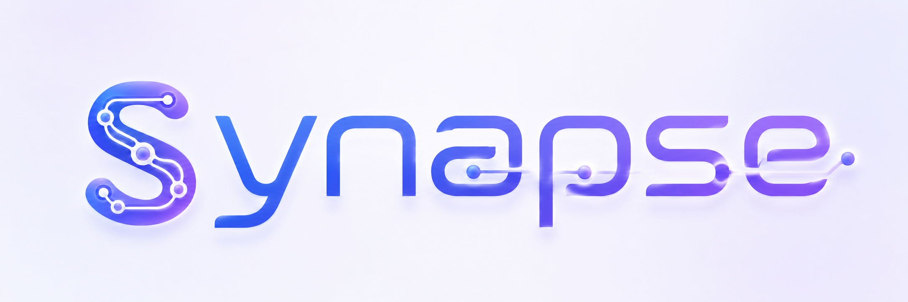
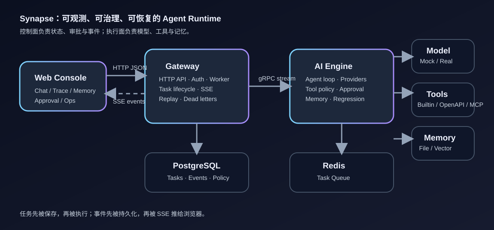
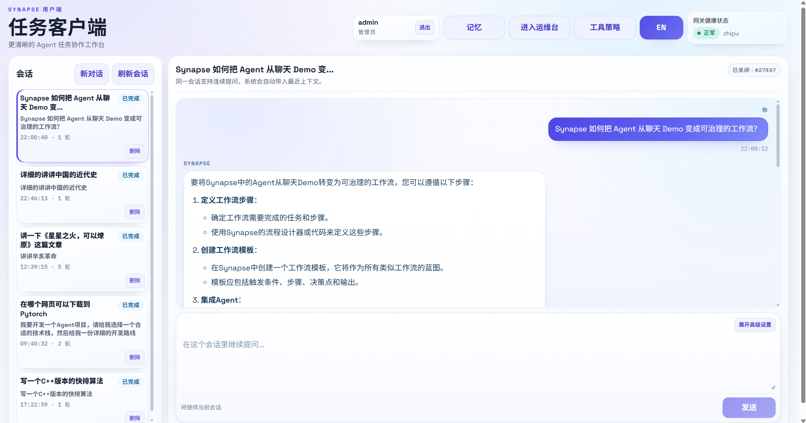
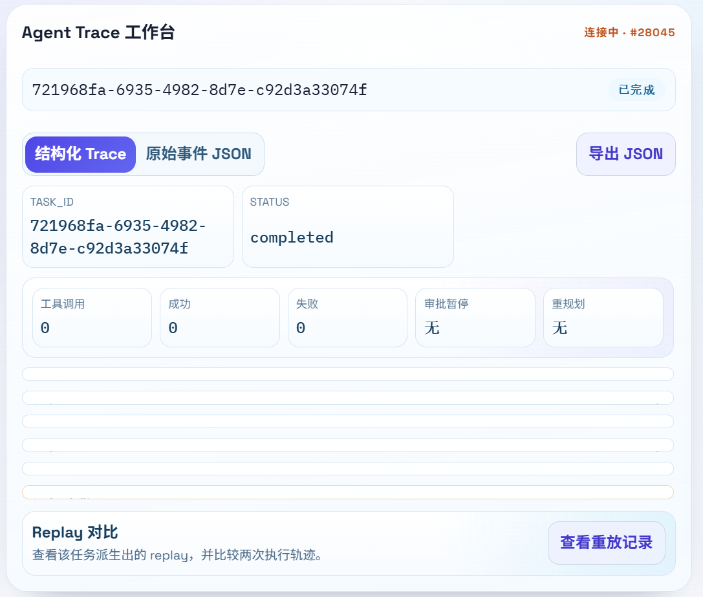
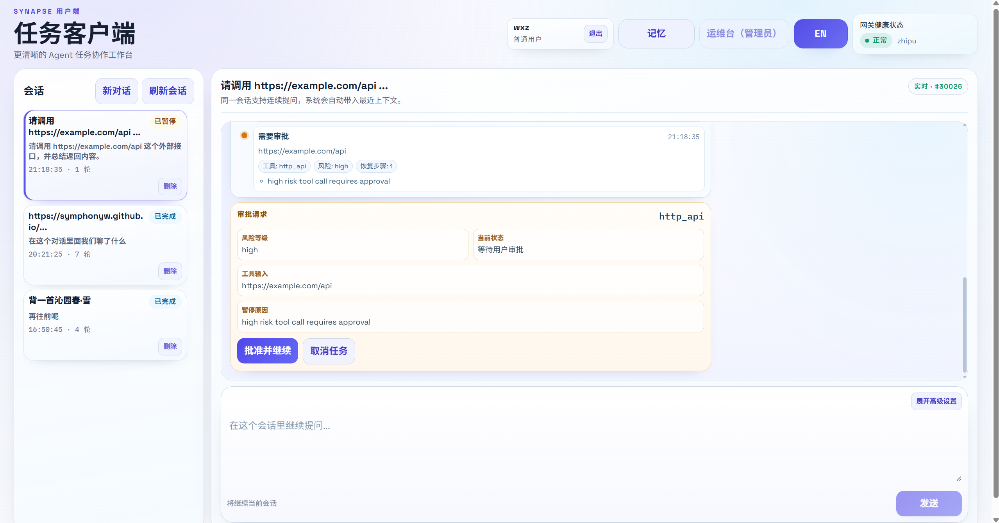
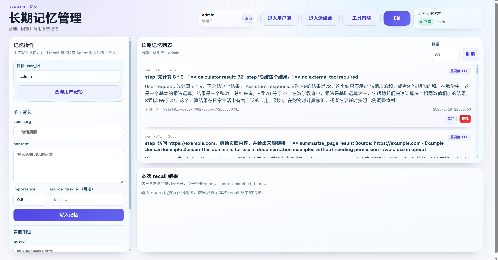
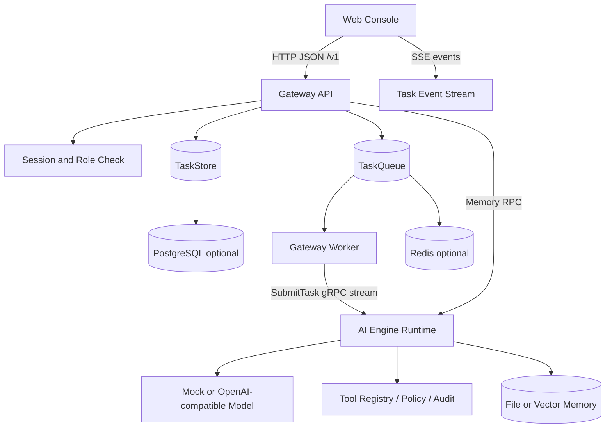
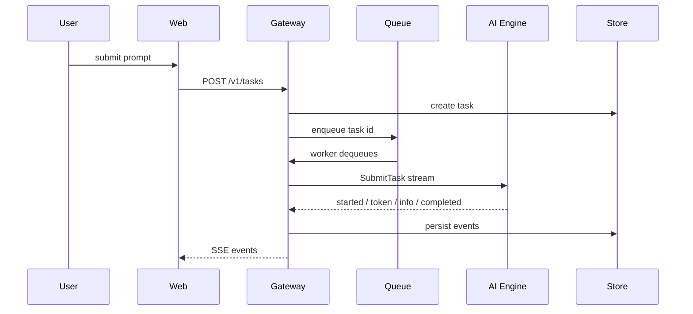

<h1 align="center">Synapse</h1>

<p align="center">
  
</p>

<p align="center">
  <a href="services/gateway-go/go.mod"></a>
  <a href="services/ai-engine-py/requirements.txt"></a>
  <a href="apps/web/package.json"></a>
  <a href="docker-compose.yml"></a>
  <a href="docs/README.md"></a>
</p>

> 一个面向真实 Agent 工作流的运行控制面：任务可追踪，工具可治理，风险动作可暂停，失败可恢复，行为可回归。

Synapse 关注的不是“把模型回复显示在聊天框里”，而是 Agent 开始调用工具、写入记忆、等待审批、重试失败任务以后，系统还能不能被理解和管理。

它把 Web 控制台、Go Gateway、Python AI Engine、任务事件流、工具策略、长期记忆和回归评测放在同一个本地工程里。你可以先用 mock provider 零成本跑通全链路，再切到 OpenAI-compatible provider 验证真实模型效果。

[快速启动](#快速启动) · [看完整工作流](#看完整工作流) · [架构](#架构) · [技术文档](docs/README.md) · [贡献指南](CONTRIBUTING.md)



## 为什么值得看

| 你会看到的能力 | Synapse 怎么处理 |
|---|---|
| 有状态任务 | `queued / running / paused / completed / failed / canceled` 全链路持久化 |
| 实时输出 | Gateway 先落事件，再通过 SSE 增量推送，支持断线后按 `last_event_id` 续读 |
| 工具治理 | 工具注册、角色授权、禁用、审批、审计统一经过 AI Engine 的 policy 层 |
| 人工审批 | 高风险工具调用会让任务进入 `paused`，owner 或 admin 审批后按原工具调用继续执行 |
| 长期记忆 | 默认文件后端开箱即用，也可切换 pgvector 语义召回 |
| Replay / Trace | 任务可以重放，Web 里可以看结构化 Trace、原始事件和差异 |
| 回归评测 | mock regression 覆盖工具、记忆、审批、失败恢复；live benchmark 可对比真实 provider |

这几个点合在一起，Synapse 更像 Agent runtime 的控制层，而不是一次性 Demo。

## 快速启动

最短路径不需要 API Key，默认使用 mock provider：

```powershell
.\scripts\dev.ps1 -Task up

# 或直接使用 Docker Compose
docker compose up --build -d
```

Compose 会先运行一次性 `migrate` 服务，将 Gateway PostgreSQL schema 升级到当前版本，然后再启动 Gateway。

启动后打开：

| 服务 | 地址 |
|---|---|
| Web 控制台 | http://127.0.0.1:5173 |
| Gateway API | http://127.0.0.1:8080 |

默认管理员账号（需手动注册）：

```text
admin / 123456
```

建议第一次进入 Web 后按这个顺序试：

1. 在聊天页创建一个任务，看 token 如何通过 SSE 流式出现。
2. 切到运维视图，看任务列表、事件和 Trace。
3. 跑一个需要审批的 Demo，观察 `paused -> approve -> resume`。
4. 写入一条长期记忆，再用 recall 验证召回。

停止服务：

```powershell
.\scripts\dev.ps1 -Task down
```

### 切到真实模型

OpenAI-compatible provider 走同一条 runtime 链路：

```powershell
Copy-Item docker-compose.openai.env.example docker-compose.openai.env
# 编辑 docker-compose.openai.env，填入 SYNAPSE_OPENAI_API_KEY 等配置

.\scripts\dev.ps1 -Task up-openai
```

Gemini、智谱和镜像源配置也有对应模板：

| 场景 | 模板 | 启动命令 |
|---|---|---|
| Gemini OpenAI-compatible | `docker-compose.gemini.env.example` | `.\scripts\dev.ps1 -Task up-gemini` |
| 智谱 OpenAI-compatible | `docker-compose.zhipu.env.example` | `.\scripts\dev.ps1 -Task up-zhipu` |
| 国内镜像源 | `docker-compose.mirror.env.example` | `.\scripts\dev.ps1 -Task up-mirror` |
| 向量记忆 | `docker-compose.vector.env.example` | `docker compose --env-file docker-compose.vector.env up --build -d` |

## 界面预览

| Web 控制台 | Agent Trace 工作台 |
|---|---|
|  |  |

| 审批暂停 | 记忆管理 |
|---|---|
|  |  |

## 看完整工作流

| Demo | 重点 |
|---|---|
| [审批型浏览 Agent](docs/70-demo-审批型浏览Agent.md) | 高风险工具触发 `approval_required`，任务暂停，审批后继续执行 |
| [记忆型助手](docs/71-demo-记忆型助手.md) | 记忆写入、召回、retrieval 和回答复用走同一条链路 |
| [OpenAPI 工具 Agent](docs/72-demo-OpenAPI工具Agent.md) | 外部 HTTP API 被发现、治理、审批并执行 |

也可以直接用 API 验证最小链路：

```powershell
$base = "http://127.0.0.1:8080"

curl.exe -s "$base/healthz"

curl.exe -s -c .\synapse.cookies `
  -H "Content-Type: application/json" `
  -d '{"username":"admin","password":"123456"}' `
  "$base/v1/auth/login"

$response = curl.exe -s -b .\synapse.cookies `
  -H "Content-Type: application/json" `
  -d '{"prompt":"hello synapse","metadata":{"agent_enabled":"true"}}' `
  "$base/v1/tasks"

$task = $response | ConvertFrom-Json
curl.exe -N -b .\synapse.cookies "$base/v1/tasks/$($task.id)/events"
```

更多可复制命令见 [接口验证手册](docs/05-接口验证手册.md)。

## 架构

Synapse 有三层主边界：

| 层 | 路径 | 职责 |
|---|---|---|
| Web Console | [apps/web](apps/web) | 聊天、任务状态、审批、记忆、Trace、工具策略管理 |
| Gateway | [services/gateway-go](services/gateway-go) | HTTP API、Cookie Session、任务入队、事件持久化、SSE、Worker、死信和 replay |
| AI Engine | [services/ai-engine-py](services/ai-engine-py) | gRPC runtime、模型 provider、Agent loop、工具治理、长期记忆、评测 |


```mermaid
flowchart TD
    Web[Web Console] -->|HTTP JSON /v1| Gateway[Gateway API]
    Web -->|SSE events| Stream[Task Event Stream]
    Gateway --> Auth[Session and Role Check]
    Gateway --> Store[(TaskStore)]
    Gateway --> Queue[(TaskQueue)]
    Queue --> Worker[Gateway Worker]
    Worker -->|SubmitTask gRPC stream| AI[AI Engine Runtime]
    Gateway -->|Memory RPC| AI
    AI --> Model[Mock or OpenAI-compatible Model]
    AI --> Tools[Tool Registry / Policy / Audit]
    AI --> Memory[(File or Vector Memory)]
    Store --> Postgres[(PostgreSQL optional)]
    Queue --> Redis[(Redis optional)]
```

一次任务的主路径：


```mermaid
sequenceDiagram
    participant U as User
    participant W as Web
    participant G as Gateway
    participant Q as Queue
    participant A as AI Engine
    participant S as Store

    U->>W: submit prompt
    W->>G: POST /v1/tasks
    G->>S: create task
    G->>Q: enqueue task id
    Q->>G: worker dequeues
    G->>A: SubmitTask stream
    A-->>G: started / token / info / completed
    G->>S: persist events
    G-->>W: SSE events
```

如果 AI Engine 返回 `approval_required`，Gateway 会把任务切到 `paused`，保存待审批工具名、输入和风险等级。审批通过后，Gateway 写入 `approved_tool_call` 并重新入队，AI Engine 只放行这一次精确匹配的工具调用。

## 功能地图

| 模块 | 已有能力 | 入口 |
|---|---|---|
| 认证与权限 | 注册、登录、退出、当前用户、admin/user 角色 | [认证与权限](docs/40-功能-认证与权限.md) |
| 任务生命周期 | 创建、查询、取消、暂停、恢复、重试、死信、重放 | [任务生命周期与事件流](docs/41-功能-任务生命周期与事件流.md) |
| 事件流 | 持久化事件、SSE 推送、终态同步、断线续读 | [协议与通信](docs/03-协议与通信.md) |
| 工具治理 | 内置工具、OpenAPI provider、MCP stdio provider、策略热更新 | [Agent 工具治理与审批策略](docs/45-功能-Agent工具治理与审批策略.md) |
| 审批恢复 | owner 聊天内审批、admin 运维台审批、精确工具调用恢复 | [审批暂停与恢复](docs/44-功能-审批暂停与恢复.md) |
| 长期记忆 | 文件后端、pgvector 后端、手工管理、召回测试 | [向量长期记忆](docs/49-功能-向量长期记忆.md) |
| Trace | 结构化 Trace、原始事件 JSON、导出、Replay Diff | [Agent Trace 工作台](docs/47-功能-Agent-Trace工作台.md) |
| 评测 | mock regression、真实 provider benchmark、Markdown 报告 | [Agent 回归评测与门禁](docs/46-功能-Agent回归评测与门禁.md) |

## 技术栈

| 分类 | 选择 |
|---|---|
| Gateway | Go 1.25、标准库 `net/http`、gRPC、`database/sql` |
| AI Engine | Python 3.12、grpcio、OpenAI-compatible `/chat/completions` |
| Web | React 19、TypeScript、Vite、Vitest、React Testing Library |
| 协议 | HTTP JSON、SSE、Protocol Buffers、gRPC streaming |
| 存储/队列 | PostgreSQL / Redis，可回退到内存实现 |
| 部署 | Dockerfile、Docker Compose、PowerShell dev script |

## 目录结构

| 路径 | 说明 |
|---|---|
| [apps/web](apps/web) | React + Vite Web 控制台 |
| [services/gateway-go](services/gateway-go) | Go Gateway、API、Worker、存储、队列、认证 |
| [services/ai-engine-py](services/ai-engine-py) | Python AI Engine、Runtime、工具、记忆、benchmark |
| [proto/synapse/v1/agent.proto](proto/synapse/v1/agent.proto) | Gateway 和 AI Engine 共享的 gRPC 契约 |
| [scripts/dev.ps1](scripts/dev.ps1) | Windows PowerShell 开发入口 |
| [docker-compose.yml](docker-compose.yml) | 本地全栈编排 |
| [docs](docs) | 架构、接口、模块、功能和 Demo 文档 |

## 开发与验证

常用命令：

```powershell
# 生成 proto
.\scripts\dev.ps1 -Task proto

# 分别启动本地服务
.\scripts\dev.ps1 -Task ai
.\scripts\dev.ps1 -Task gateway
.\scripts\dev.ps1 -Task web

# Agent 回归
.\scripts\dev.ps1 -Task agent-regression

# Gateway 数据库 migration
.\scripts\dev.ps1 -Task migrate-status
.\scripts\dev.ps1 -Task migrate-up
```

完整验证：

```powershell
# Gateway
Set-Location services/gateway-go
go test ./...
Set-Location ..\..

# AI Engine
Set-Location services/ai-engine-py
python -m unittest discover -s tests -p "test_*.py"
python -m app.benchmarks.regression
Set-Location ..\..

# Web
Set-Location apps/web
npm run lint
npm run build
npm run test
Set-Location ..\..
```

真实模型 benchmark：

```powershell
Set-Location services/ai-engine-py
python -m app.benchmarks.live_benchmark --provider openai --dry-run-config-check
python -m app.benchmarks.live_benchmark --provider openai --markdown
Set-Location ..\..
```

## 当前边界

Synapse 适合本地研究、架构验证、Demo 和二次开发。它已经有完整的 Agent 控制链路，但还不是可以直接进生产的发行版。

| 已打通 | 仍需补齐 |
|---|---|
| 任务、事件、审批、记忆、Trace、Replay、Regression 主链路 | 生产级监控、告警和 SLO |
| Docker Compose 一键启动全栈 | 生产级 HTTPS、Cookie Secure、CSRF、防爆破和 secret 管理 |
| Gateway 版本化 PostgreSQL migration | Redis 队列 ack/reclaim 语义 |
| OpenAI-compatible provider、OpenAPI 工具、MCP stdio 接入 | 完整 OpenAPI/Swagger 文档 |
| Web 管理工具策略并热更新到 AI Engine | CI/CD、镜像扫描、发布和回滚流程 |

## 继续阅读

| 目标 | 推荐入口 |
|---|---|
| 第一次启动 | [部署与启动](docs/02-部署与启动.md) |
| 验证 HTTP / SSE / 记忆接口 | [接口验证手册](docs/05-接口验证手册.md) |
| 理解整体架构 | [总体架构](docs/01-总体架构.md) |
| 深入 Gateway | [Gateway API 模块](docs/12-gateway-api模块.md) |
| 深入 AI Engine | [AI Engine 模块](docs/20-ai-engine模块.md) |
| 深入 Web | [Web 模块](docs/30-web模块.md) |
| 排查问题 | [运维排障手册](docs/50-运维排障手册.md) |
| 看后续开发方向 | [后续开发任务清单](docs/61-后续开发任务清单.md) |
