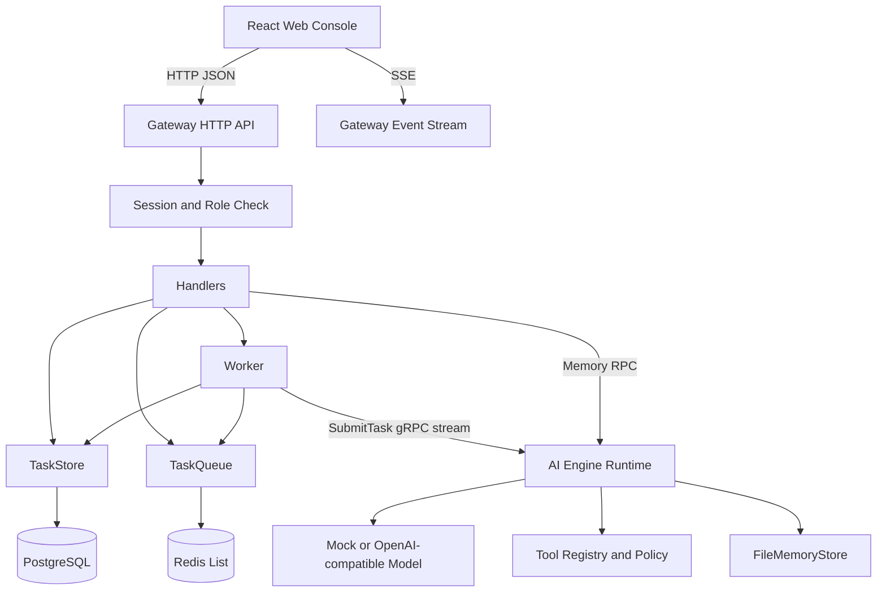

# 总体架构

Synapse 是前后端分离的多服务工程，核心链路是 Web 提交 Agent 任务，Gateway 负责任务控制面，AI Engine 负责模型和工具执行面，Postgres/Redis 提供可选持久化和队列能力。

## 组件边界

| 组件 | 路径 | 主要职责 |
|---|---|---|
| Web Console | [apps/web](../apps/web) | 登录注册、用户会话视图、运维视图、任务事件展示、审批和死信操作 |
| Gateway | [services/gateway-go](../services/gateway-go) | HTTP API、Cookie Session、权限、任务落库、队列投递、SSE、Worker |
| AI Engine | [services/ai-engine-py](../services/ai-engine-py) | gRPC Runtime、mock/openai provider、Agent loop、工具治理、长期记忆 |
| Protocol | [proto/synapse/v1/agent.proto](../proto/synapse/v1/agent.proto) | Gateway 与 AI Engine 的 gRPC 契约 |
| Postgres | [docker-compose.yml](../docker-compose.yml) | 任务、事件、死信、用户、会话持久化 |
| Redis | [docker-compose.yml](../docker-compose.yml) | 任务 ID 队列 |

## 请求链路

| 阶段 | 行为 | 关键实现 |
|---|---|---|
| 认证 | 登录后写入 `synapse_session_token` Cookie，后续接口读取会话 | [handlers_auth.go](../services/gateway-go/internal/api/handlers_auth.go) |
| 创建任务 | Gateway 忽略客户端伪造的 user_id，以会话用户名作为任务 owner | [handlers.go](../services/gateway-go/internal/api/handlers.go) |
| 入队 | 任务先写 TaskStore，再将 task id 放入 TaskQueue | [handlers.go](../services/gateway-go/internal/api/handlers.go) |
| 执行 | Worker 出队后调用 AI Engine `SubmitTask` gRPC stream | [processor.go](../services/gateway-go/internal/worker/processor.go) |
| 事件持久化 | Worker 将 gRPC AgentEvent 转成 task_events | [processor.go](../services/gateway-go/internal/worker/processor.go) |
| SSE 输出 | Gateway 从 TaskStore 增量读取事件，按 `last_event_id` 输出 | [handlers.go](../services/gateway-go/internal/api/handlers.go) |
| 审批暂停 | AI Engine 输出 `approval_required`，Worker 切换任务到 paused | [runtime.py](../services/ai-engine-py/app/runtime.py), [processor.go](../services/gateway-go/internal/worker/processor.go) |
| 恢复执行 | `/approve` 写入审批元数据和事件，任务重新入队 | [handlers.go](../services/gateway-go/internal/api/handlers.go) |

## 数据与外部服务

| 服务 | 是否必须 | 说明 |
|---|---|---|
| Postgres | 否 | 配置 `SYNAPSE_DATABASE_URL` 后启用；不可用时回退内存存储 |
| Redis | 否 | 配置 `SYNAPSE_REDIS_ADDR` 后启用；不可用时回退内存队列 |
| OpenAI-compatible API | 否 | `mock` provider 不需要；`openai` provider 需要 API Key |
| 文件系统 | 是 | AI Engine 文件型记忆和工具审计日志使用本地文件 |

## 架构优点和限制

| 类型 | 内容 |
|---|---|
| 优点 | Gateway 与模型执行解耦；事件先持久化再 SSE 输出；基础设施可回退；Agent 工具策略集中在 Runtime；长期记忆和工具 provider 有清晰扩展点 |
| 限制 | Compose 未包含 Web 服务；Postgres 自动建表无 migration；Redis List 无 ack/reclaim；生产安全和 CI/CD 仍待完善；OpenAPI/MCP provider 目前是扩展壳，真实外部连接待补 |

## 代码入口

| 入口 | 文件 |
|---|---|
| Gateway main | [services/gateway-go/cmd/server/main.go](../services/gateway-go/cmd/server/main.go) |
| Gateway router | [services/gateway-go/internal/api/router.go](../services/gateway-go/internal/api/router.go) |
| Gateway worker | [services/gateway-go/internal/worker/processor.go](../services/gateway-go/internal/worker/processor.go) |
| AI Engine main | [services/ai-engine-py/app/main.py](../services/ai-engine-py/app/main.py) |
| AI Engine service | [services/ai-engine-py/app/service.py](../services/ai-engine-py/app/service.py) |
| AI Engine runtime | [services/ai-engine-py/app/runtime.py](../services/ai-engine-py/app/runtime.py) |
| Web entry | [apps/web/src/main.tsx](../apps/web/src/main.tsx) |
