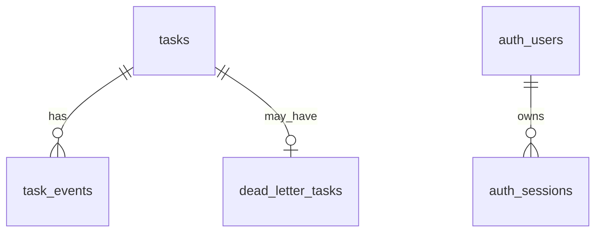

# 数据库与存储

Synapse 当前使用 Gateway 侧 TaskStore 管理任务、事件、死信、用户、会话和工具策略；AI Engine 使用文件型 MemoryStore 管理长期记忆。仓库没有 migration 文件，Postgres schema 由 Gateway 启动时自动创建。

## 存储组件

| 存储 | 实现 | 启用条件 | 回退 |
|---|---|---|---|
| TaskStore | [postgres.go](../services/gateway-go/internal/store/postgres.go) | 设置 `SYNAPSE_DATABASE_URL` 且连接成功 | [inmemory.go](../services/gateway-go/internal/store/inmemory.go) |
| TaskQueue | [redis.go](../services/gateway-go/internal/queue/redis.go) | 设置 `SYNAPSE_REDIS_ADDR` 且连接成功 | [inmemory.go](../services/gateway-go/internal/queue/inmemory.go) |
| MemoryStore | [memory.py](../services/ai-engine-py/app/memory.py) | `SYNAPSE_AGENT_MEMORY_FILE` 非空 | 路径为空则记忆不可写 |
| Tool Audit | [audit.py](../services/ai-engine-py/app/tools/audit.py) | `SYNAPSE_AGENT_TOOL_AUDIT_LOG_FILE` 非空 | 路径为空则不记录 |

## Postgres 自动建表

入口：[PostgresStore.ensureSchema](../services/gateway-go/internal/store/postgres.go)。

| 表 | 用途 | 关键字段 |
|---|---|---|
| `tasks` | 任务主记录 | `id`、`user_id`、`prompt`、`status`、`error`、`metadata`、`created_at`、`updated_at` |
| `task_events` | 任务事件流和审计 | `id`、`task_id`、`event_type`、`message`、`token`、`trace_id`、`emitted_at_unix_ms`、`created_at` |
| `dead_letter_tasks` | 重试耗尽后的死信记录 | `task_id`、`reason`、`attempts`、`created_at`、`updated_at` |
| `auth_users` | 用户账号 | `username`、`password_hash`、`role`、`created_at`、`updated_at` |
| `auth_sessions` | 登录会话 | `token`、`username`、`role`、`expires_at`、`created_at` |
| `tool_policies` | 管理员工具策略单例快照 | `id`、`role_allow`、`approval_required`、`disabled_tools`、`version`、`updated_at`、`updated_by`、`description` |

表关系：



约束和索引：

| 名称 | 说明 |
|---|---|
| `tasks.id` | 主键 |
| `task_events.task_id` | 外键引用 `tasks(id)`，`ON DELETE CASCADE` |
| `dead_letter_tasks.task_id` | 主键且外键引用 `tasks(id)`，`ON DELETE CASCADE` |
| `auth_users.username` | 主键 |
| `auth_sessions.username` | 外键引用 `auth_users(username)`，`ON DELETE CASCADE` |
| `idx_task_events_task_id_id` | SSE 增量读取事件 |
| `idx_tasks_user_conversation_created` | 会话上下文和会话删除 |
| `idx_auth_sessions_username` | 按用户名清理会话 |
| `idx_auth_sessions_expires_at` | 清理过期会话 |

## tasks.metadata

`tasks.metadata` 使用 JSONB，便于承载会话、权限、Agent 和审批字段。

| Key | 写入方 | 说明 |
|---|---|---|
| `conversation_id` | Web/Gateway | 会话 ID |
| `user_message` | Gateway | 当前轮用户消息 |
| `client_view` | Web | `chat` 表示聊天视图 |
| `model_prompt` | Gateway | 文本上下文兼容字段 |
| `model_messages_json` | Gateway | OpenAI messages JSON |
| `auth_user_role` | Gateway | 可信角色 |
| `auth_username` | Gateway | 可信用户名 |
| `agent_enabled` | Web/Gateway | 是否启用 Agent loop |
| `memory_write_enabled` | Web/Gateway | 是否写长期记忆 |
| `approval_granted` | Gateway | 审批恢复标记 |
| `approved_tools` | Gateway/Web | 旧版工具级审批 |
| `approved_tool_call` | Gateway | 精确工具调用审批 |
| `agent_resume_step_index` | Gateway | 恢复步点 |
| `agent_required_tool` | Worker | 触发审批的工具名 |
| `agent_required_tool_input` | Worker | 触发审批的工具输入 |
| `agent_required_tool_risk_level` | Worker | 触发审批的风险等级 |
| `agent_required_reason` | Worker | 触发审批原因 |
| `agent_resume_requested_by` | Gateway | 审批恢复操作者 |

## Redis 队列

Redis 队列使用 List：

| 操作 | 命令 | 实现 |
|---|---|---|
| 入队 | `LPUSH` | [RedisQueue.Enqueue](../services/gateway-go/internal/queue/redis.go) |
| 出队 | `BRPOP` | [RedisQueue.Dequeue](../services/gateway-go/internal/queue/redis.go) |

默认队列名：`synapse:tasks`。

当前限制：

1. 没有 ack/reclaim。
2. Worker 进程异常退出时，已出队但未完成的任务不会自动回收。
3. 当前主程序启动一个 Worker 循环，未提供多 worker 配置。

## 内存回退

Gateway 默认先创建内存实现，再尝试升级为 Postgres/Redis：

1. Postgres 连接失败：记录日志并继续使用 InMemoryStore。
2. Redis 连接失败：记录日志并继续使用 InMemoryQueue。

适合场景：

| 场景 | 是否适合 |
|---|---|
| 单元测试 | 适合 |
| 本地无依赖快速调试 | 适合 |
| 生产环境 | 不适合 |

## 长期记忆文件

AI Engine 使用 FileMemoryStore：

| 配置 | 默认 |
|---|---|
| `SYNAPSE_AGENT_MEMORY_FILE` | Docker Compose 中为 `/var/lib/synapse/agent-memory.json` |
| `SYNAPSE_AGENT_MEMORY_MAX_ENTRIES_PER_USER` | `80` |
| `SYNAPSE_AGENT_MEMORY_RECALL_LIMIT` | `3` |

文件结构由 [memory.py](../services/ai-engine-py/app/memory.py) 维护：

```json
{
  "version": 2,
  "backend": "file",
  "users": {
    "admin": [
      {
        "memory_id": "mem_xxx",
        "user_id": "admin",
        "content": "...",
        "summary": "...",
        "source_task_id": "...",
        "importance": 0.8,
        "created_at": 1710000000000
      }
    ]
  }
}
```

召回策略是轻量关键词匹配加 importance 加权；没有命中时回退最近记忆。`VectorMemoryStore` 目前只是接口骨架，未实现向量库。

## 运维建议

| 风险 | 建议 |
|---|---|
| 自动建表不可追踪版本 | 引入 migration 工具 |
| 默认管理员密码 | 生产必须覆盖 `SYNAPSE_AUTH_ADMIN_PASSWORD` |
| 内存回退误用于生产 | 启动时增加强制依赖检查或健康门禁 |
| Redis List 无可靠投递 | 替换为 Streams、消息队列或带 ack/reclaim 的方案 |
| 记忆文件单点 | 后续迁移到数据库或向量存储 |
| 审计日志本地落盘 | 生产环境接入集中日志系统 |
