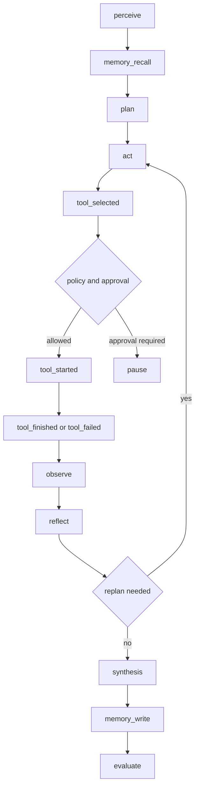

# AI Engine 模块

AI Engine 是 Synapse 的执行面，提供 gRPC Runtime 给 Gateway 调用，负责模型访问、Agent 规划循环、工具调用、审批暂停、长期记忆和回归评测。

## 关键文件

| 文件 | 说明 |
|---|---|
| [main.py](../services/ai-engine-py/app/main.py) | 加载配置并启动 gRPC server |
| [config.py](../services/ai-engine-py/app/config.py) | 从环境变量读取 Runtime 配置 |
| [service.py](../services/ai-engine-py/app/service.py) | gRPC 服务门面，暴露 Health、SubmitTask、Memory RPC |
| [runtime.py](../services/ai-engine-py/app/runtime.py) | Agent loop、模型 provider、工具执行、审批、记忆 |
| [memory.py](../services/ai-engine-py/app/memory.py) | FileMemoryStore 与 VectorMemoryStore 接口骨架 |
| [tools](../services/ai-engine-py/app/tools) | 工具协议、注册表、策略、审计和 provider 扩展 |
| [benchmarks](../services/ai-engine-py/app/benchmarks) | Agent mock 回归评测 |

## 配置项

| 变量 | 默认值 | 说明 |
|---|---|---|
| `SYNAPSE_AI_BIND_ADDR` | `0.0.0.0:50051` | gRPC 监听地址 |
| `SYNAPSE_MODEL_PROVIDER` | `mock` | `mock` 或 `openai` |
| `SYNAPSE_MODEL_PROVIDER_ALIAS` | 空 | health 展示别名 |
| `SYNAPSE_OPENAI_API_KEY` | 空 | openai 模式必填 |
| `SYNAPSE_OPENAI_BASE_URL` | 空 | 默认 `https://api.openai.com/v1` |
| `SYNAPSE_OPENAI_MODEL` | `gpt-4o-mini` | 模型名 |
| `SYNAPSE_OPENAI_TEMPERATURE` | `0.2` | temperature |
| `SYNAPSE_OPENAI_MAX_TOKENS` | `512` | 最大输出 |
| `SYNAPSE_OPENAI_HTTP_TIMEOUT_SECONDS` | `45` | HTTP 超时 |
| `SYNAPSE_OPENAI_MAX_RETRIES` | `3` | 最大重试 |
| `SYNAPSE_OPENAI_RETRY_BACKOFF_SECONDS` | `1.5` | 重试退避 |
| `SYNAPSE_OPENAI_CONTINUATION_MAX_ROUNDS` | `8` | 长文本/截断输出的最大自动续写轮数 |
| `SYNAPSE_OPENAI_LONG_FORM_MIN_CHARS` | `2400` | 长文本完成前的最低字符预算 |
| `SYNAPSE_AGENT_ENABLED_DEFAULT` | `true` | 默认启用 Agent loop |
| `SYNAPSE_AGENT_MAX_PLAN_STEPS` | `6` | 最大计划步数 |
| `SYNAPSE_AGENT_GENERATION_TIMEOUT_SECONDS` | `30` | 最终回复首 token 等待超时 |
| `SYNAPSE_AGENT_STREAM_IDLE_TIMEOUT_SECONDS` | `15` | 模型流式输出空闲超时 |
| `SYNAPSE_AGENT_REQUIRE_APPROVAL_FOR_HIGH_RISK` | `true` | 高风险工具默认审批 |
| `SYNAPSE_AGENT_MEMORY_FILE` | `/tmp/synapse-agent-memory.json` | 长期记忆文件 |
| `SYNAPSE_AGENT_MEMORY_MAX_ENTRIES_PER_USER` | `80` | 每用户记忆上限 |
| `SYNAPSE_AGENT_MEMORY_RECALL_LIMIT` | `3` | 每次召回条数 |
| `SYNAPSE_AGENT_TOOL_HTTP_ALLOWLIST` | 空 | HTTP/浏览工具 allowlist |
| `SYNAPSE_AGENT_TOOL_HTTP_TIMEOUT_SECONDS` | `12` | HTTP/浏览工具超时 |
| `SYNAPSE_AGENT_ENABLE_CODE_EXECUTION` | `false` | 是否启用 code_exec |
| `SYNAPSE_AGENT_TOOL_POLICY_JSON` | 空 | 工具策略 JSON |
| `SYNAPSE_AGENT_TOOL_AUDIT_LOG_FILE` | `/tmp/synapse-agent-tool-audit.log` | 工具审计日志 |

## gRPC 服务

| RPC | 实现 | 说明 |
|---|---|---|
| `Health` | `AgentRuntimeService.Health` | 返回 `status=ok` 和 provider display |
| `SubmitTask` | `AgentRuntimeService.SubmitTask` | 发送 started，转发 Runtime info/token，结束时发送 completed 或 failed |
| `MemoryWrite` | `AgentRuntimeService.MemoryWrite` | 写入 FileMemoryStore |
| `MemoryRecall` | `AgentRuntimeService.MemoryRecall` | 召回 FileMemoryStore |
| `MemoryDelete` | `AgentRuntimeService.MemoryDelete` | 删除指定记忆 |
| `MemoryList` | `AgentRuntimeService.MemoryList` | 列出用户记忆 |

## 模型 provider

| Provider | 行为 |
|---|---|
| `mock` | 本地确定性输出，适合启动、测试、评测 |
| `openai` | 调用 OpenAI-compatible `/chat/completions`，先尝试 `stream=true` |
| `gemini` / `zhipu` | Runtime 会归一到 openai 通道，并保留 alias |

openai 模式细节：

1. 不依赖 OpenAI SDK，使用 Python 标准库 `urllib`。
2. 支持 SSE stream 增量解析。
3. 如果首包前 stream 失败，回退普通 completion。
4. 对 429、500、502、503、504 和网络错误做有限重试。
5. 支持 `model_messages_json` 作为多轮 messages 输入。

长文本生成细节：

| 机制 | 行为 |
|---|---|
| 长文本识别 | 用户请求详细讲解、完整说明、报告、长文等需求时启用 |
| 完成标记 | Runtime 向模型注入内部 `[[SYNAPSE_DONE]]` 协议，并在输出给用户前过滤 |
| 完整性检查 | 未达到 `SYNAPSE_OPENAI_LONG_FORM_MIN_CHARS`、代码块未闭合、结尾不是自然终止，或用户要求结论但尾部没有 conclusion/summary/总结/结论时继续 |
| 截断续写 | `finish_reason=length`、`max_tokens`、`stream_error` 会自动续写 |
| 供应商中断 | 长文本已有可见内容时，`content_filter`、`safety`、`sensitive`、`blocked` 视为可续写中断；无内容或短问仍终止 |
| 续写上限 | 由 `SYNAPSE_OPENAI_CONTINUATION_MAX_ROUNDS` 控制，防止无限循环 |

该能力不是针对中文的特殊分支，而是根据用户需求判断是否需要长文本，并用 provider 通用的 stream、finish_reason、内部完成标记和完整性检查来补全回复。

## Agent loop

Agent loop 由 [runtime.py](../services/ai-engine-py/app/runtime.py) 实现。

标准 info 事件包含：

| 阶段 | 说明 |
|---|---|
| `perceive` | 读取任务、短上下文和记忆数量 |
| `memory_recall` | 返回召回命中 |
| `plan` | 输出计划步骤 |
| `act` | 进入某个步骤 |
| `tool_selected` | 选择工具 |
| `tool_started` | 工具开始执行 |
| `tool_finished` | 工具成功 |
| `tool_failed` | 工具失败 |
| `tool_skipped` | 无工具或被策略阻断 |
| `approval_required` | 需要审批，Runtime 返回 pause |
| `replan` | 工具失败后的替代计划 |
| `observe` | 记录观察结果 |
| `reflect` | 总结步骤 |
| `synthesis_mode` | 真实 provider 下的最终生成模式 |
| `memory_write` | 写入长期记忆 |
| `evaluate` | 输出完成度、工具成功率、阻断数和耗时 |

## 内置工具

| 工具 | 风险 | 默认审批 | 说明 |
|---|---|---|---|
| `retrieval` | low | 否 | 读取已召回长期记忆 |
| `calculator` | low | 否 | 受限数学表达式 |
| `browser_fetch` | high | 是 | 抓取 allowlist 内 URL |
| `http_api` | high | 是 | 抓取 allowlist 内 API，尽量保留 JSON |
| `code_exec` | high | 是 | 受限表达式执行，受 `SYNAPSE_AGENT_ENABLE_CODE_EXECUTION` 控制 |
| `json_echo` | low | 否 | 调试回显 |
| `search` | medium | 否 | 从查询中发现可浏览来源 |
| `open_url` | high | 是 | 打开 allowlist URL |
| `extract_text` | high | 是 | 提取网页文本 |
| `summarize_page` | high | 是 | 抓取并摘要网页 |
| `source_citation` | low | 否 | 格式化来源引用，不发网络请求 |

## 长期记忆

FileMemoryStore 使用 JSON 文件保存每个用户的记忆。Runtime 在任务开始时召回，在任务结束后按 `memory_write_enabled` 写入。

| 能力 | 实现 |
|---|---|
| 自动召回 | `AgentRuntime.run_task` 调 `memory_recall` |
| 自动写入 | 任务完成后写入 prompt、response 摘要和 success 评分 |
| 手工管理 | Gateway `/v1/memories` 转发 Memory RPC |
| 旧格式兼容 | 读取时兼容旧的 `prompt/summary/final_response_preview` |
| 向量后端 | `VectorMemoryStore` 是接口骨架，未实现 |

## 工具扩展 provider

| Provider | 状态 | 说明 |
|---|---|---|
| `BuiltinToolProvider` | 已完成 | 注册内置工具 |
| `LocalClassToolProvider` | 已完成 | 将本地 Python class 或实例注册为工具 |
| `OpenAPIToolProvider` | 部分完成 | 可从 OpenAPI spec 发现工具和 schema，真实 HTTP executor 需要注入 |
| `MCPToolProvider` | 部分完成 | 定义 MCP adapter 接口和包装工具，真实 MCP transport 待接入 |

扩展工具不会绕过策略。所有 provider 注册后的工具仍经过 ToolRegistry 校验、ToolPolicy 角色授权、审批判断和 ToolAuditLogger 审计。

## 测试与评测

| 命令 | 说明 |
|---|---|
| `python -m unittest discover -s tests -p "test_*.py"` | Python 单元测试 |
| `python -m app.benchmarks.regression` | Agent mock 回归评测 |
| `.\scripts\dev.ps1 -Task verify-agent-mode` | 打印当前 Agent 配置摘要 |

当前测试覆盖：

1. FileMemoryStore 写入、召回、删除、兼容旧格式。
2. 工具协议、标准事件、审批、审计。
3. Local/OpenAPI/MCP provider 注册和执行壳。
4. Agent regression 指标与用例判定。

## 当前限制

| 限制 | 建议 |
|---|---|
| planner 仍以启发式为主 | 后续接入模型工具选择或策略规划器 |
| OpenAPI/MCP provider 未接真实外部连接 | 补 executor、认证和 transport |
| FileMemoryStore 非高并发共享存储 | 后续迁移数据库或向量存储 |
| 工具 HTTP allowlist 需要手工配置 | 增加配置校验和管理 UI |
| 审计日志本地落盘 | 接入集中日志和指标 |
