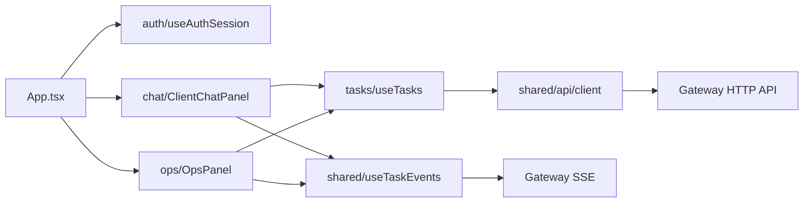

# Web 前端工程结构

本页描述 `apps/web` 在本次工程化升级后的组织方式。目标不是引入新的大型状态库，而是先把“谁负责什么”刻清楚，让后续功能继续增长时不再重新坍回单文件中心化。

```text
src
├─ features
│  ├─ auth          登录、注册、会话恢复
│  ├─ chat          用户聊天面板、会话列表、Agent 时间线
│  ├─ memory        长期记忆页面与 hook
│  ├─ ops           运维页、死信
│  ├─ tasks         任务 API、任务 hook、任务列表、任务详情
│  ├─ tool-policy   工具策略页面与 hook
│  └─ trace         Trace 工作台
└─ shared
   ├─ api           API base path、统一 client
   ├─ components    应用壳层组件
   ├─ hooks         健康检查、SSE
   ├─ types         通用领域类型
   └─ utils         格式化、记录解析、事件工具
```

| 层次 | 约束 |
|---|---|
| `App.tsx` | 只处理语言、模式、页面编排 |
| feature hook | 负责单一领域的数据获取与交互状态 |
| feature component | 负责该领域渲染 |
| `shared/api/client.ts` | 统一 credentials、非 2xx、JSON 解析和错误类型 |
| `shared/hooks/useTaskEvents.ts` | 统一 SSE 续传、事件去重、历史补水和 token 缓存 |

## 数据流



## 测试

当前测试基座：

| 类型 | 示例 |
|---|---|
| API client | `shared/api/client.test.ts` |
| 纯函数 | `features/memory/api.test.ts`、`features/trace/*.test.ts` |
| 组件渲染 / 交互 | `features/auth/AuthScreen.test.tsx` |

命令：

```powershell
Set-Location apps/web
npm run test
```

## 配置

| 变量 | 默认值 | 说明 |
|---|---|---|
| `VITE_API_BASE_PATH` | 空字符串 | 前端 API base path；默认同源 |
| `VITE_HEALTH_PATH` | `/healthz` | 健康检查路径 |
| `VITE_DEV_PROXY_TARGET` | `http://127.0.0.1:8080` | Vite 本地代理目标 |

生产容器默认保持前端同源访问，由 Nginx 将 `/v1` 与 `/healthz` 反代到 `gateway`。这样浏览器仍使用相对路径，Cookie 会话也无需额外跨域处理。
