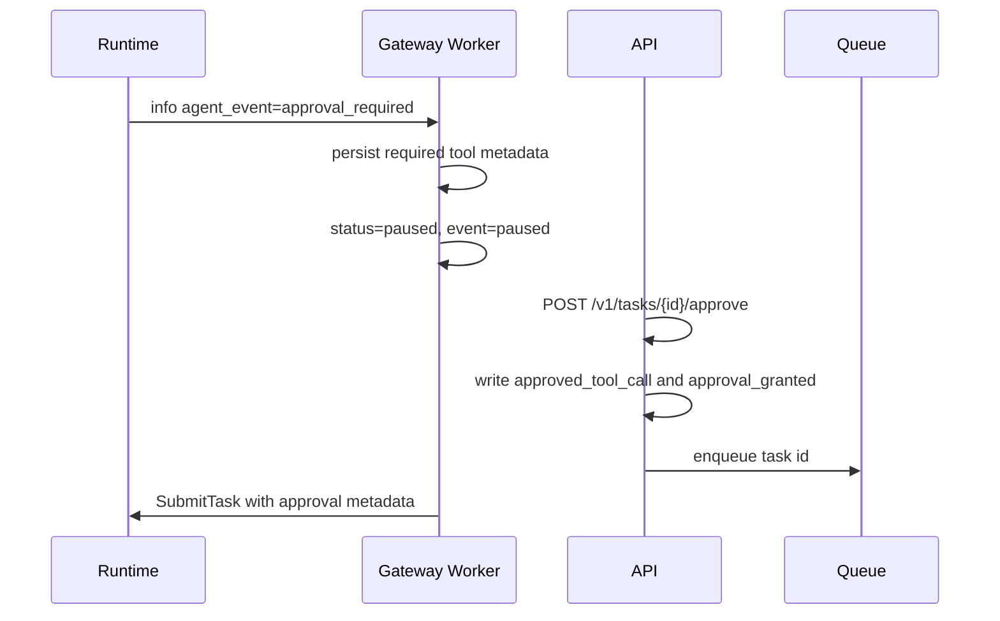
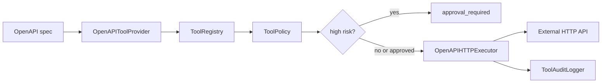
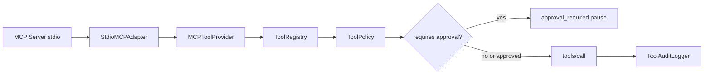

# 功能：Agent 工具治理与审批策略

Agent 工具治理的目标是让 Runtime 可以调用工具，同时保持角色授权、风险审批、禁用策略和审计日志在统一边界内执行。

## 相关实现

| 文件 | 说明 |
|---|---|
| [runtime.py](../services/ai-engine-py/app/runtime.py) | 工具选择、策略判断、审批暂停、执行和标准事件 |
| [base.py](../services/ai-engine-py/app/tools/base.py) | ToolCall、ToolContext、ToolResult、AgentTool 协议 |
| [registry.py](../services/ai-engine-py/app/tools/registry.py) | 工具注册、schema 校验、provider 元数据 |
| [builtin.py](../services/ai-engine-py/app/tools/builtin.py) | 内置工具和 BuiltinToolProvider |
| [policy.py](../services/ai-engine-py/app/tools/policy.py) | 角色授权、审批集合、禁用工具 |
| [audit.py](../services/ai-engine-py/app/tools/audit.py) | JSONL 工具审计日志 |
| [providers.py](../services/ai-engine-py/app/tools/providers.py) | LocalClass、OpenAPI、MCP provider 扩展 |
| [openapi_executor.py](../services/ai-engine-py/app/tools/openapi_executor.py) | OpenAPI HTTP executor、allowlist、鉴权和响应限制 |
| [mcp_stdio.py](../services/ai-engine-py/app/tools/mcp_stdio.py) | MCP stdio 子进程、JSON-RPC、工具发现和调用适配 |

## 工具协议

所有工具都需要满足 `AgentTool` 协议：

| 字段/方法 | 说明 |
|---|---|
| `name` | 工具名，策略和事件使用该名称 |
| `description` | 工具说明 |
| `input_schema` | 结构化输入 schema |
| `risk_level` | `low`、`medium`、`high`、`critical` |
| `requires_approval` | 是否默认需要审批 |
| `execute(call, context)` | 执行 ToolCall 并返回 ToolResult |

`ToolCall` 同时支持旧的 `input_text` 和新的结构化 `arguments`。工具应优先读取结构化参数，再回退文本输入。

## 内置工具清单

| 工具 | 风险 | 默认审批 | 说明 |
|---|---|---|---|
| `retrieval` | low | 否 | 读取当前任务已召回的长期记忆 |
| `calculator` | low | 否 | 受限数学表达式计算 |
| `browser_fetch` | high | 是 | 抓取 allowlist 内网页 |
| `http_api` | high | 是 | 抓取 allowlist 内 HTTP API |
| `code_exec` | high | 是 | 受限表达式执行，默认禁用执行能力 |
| `json_echo` | low | 否 | 回显结构化调用信息 |
| `search` | medium | 否 | 从查询中产生候选来源 URL |
| `open_url` | high | 是 | 打开 allowlist URL |
| `extract_text` | high | 是 | 提取网页文本 |
| `summarize_page` | high | 是 | 抓取并摘要页面 |
| `source_citation` | low | 否 | 格式化来源引用 |

## 默认角色策略

| 角色 | 默认允许 |
|---|---|
| `admin` | `*` |
| `user` | retrieval、calculator、browser_fetch、http_api、search、open_url、extract_text、summarize_page、source_citation、json_echo |

`code_exec` 不在普通用户默认白名单中。即使 admin 允许工具，若工具需要审批，仍需要满足审批条件。

## 策略配置

通过 `SYNAPSE_AGENT_TOOL_POLICY_JSON` 覆盖策略：

```json
{
  "role_allow": {
    "user": ["retrieval", "calculator", "search"],
    "admin": ["*"]
  },
  "approval_required": ["summarize_page", "http_api", "code_exec"],
  "disabled_tools": ["code_exec"]
}
```

规则：

1. `disabled_tools` 优先级最高。
2. `role_allow` 不存在的角色会回退到 `user`。
3. `approval_required` 覆盖默认审批集合。
4. 当 `SYNAPSE_AGENT_REQUIRE_APPROVAL_FOR_HIGH_RISK=true`，高风险或声明 `requires_approval=true` 的工具会加入默认审批集合。

## 审批模型

旧审批方式：

```text
approved_tools=summarize_page,retrieval
```

新审批方式：

```json
{
  "tool_name": "summarize_page",
  "tool_input": "https://example.com",
  "risk_level": "high",
  "reason": "ops approval",
  "resume_step_index": 1
}
```

新方式通过 `approved_tool_call` 存在任务 metadata 中。Runtime 放行时会匹配：

| 字段 | 作用 |
|---|---|
| `tool_name` | 必须等于当前工具 |
| `tool_input` | 必须和当前工具输入归一化后相同 |
| `risk_level` | 如存在，必须和当前工具风险一致 |
| `resume_step_index` | 如大于 0，必须等于当前执行步点 |

这样可以避免“同名工具换参数”被误放行。

## 审批暂停链路



## 审计日志

配置 `SYNAPSE_AGENT_TOOL_AUDIT_LOG_FILE` 后，Runtime 会写 JSONL：

| 字段 | 说明 |
|---|---|
| `timestamp_unix_ms` | 审计时间 |
| `task_id` | 任务 ID |
| `user_id` | 用户 |
| `user_role` | 角色 |
| `action` | `executed`、`failed`、`blocked`、`approval_required`、`approved` 等 |
| `tool` | 工具名 |
| `tool_input_preview` | 工具输入预览，最多 240 字符 |
| `risk_level` | 风险 |
| `ok` | 是否成功 |
| `outcome` | 结果摘要 |
| `reason` | 原因 |
| `duration_ms` | 耗时 |
| `details` | 结构化细节 |

## Provider 扩展

| Provider | 作用 | 当前状态 |
|---|---|---|
| `LocalClassToolProvider` | 注册本地 Python 工具类或实例 | 可用 |
| `OpenAPIToolProvider` | 从 OpenAPI paths/operationId/parameters/requestBody 发现工具 | 可通过 `OpenAPIHTTPExecutor` 发起受控 HTTP 调用 |
| `MCPToolProvider` | 将 MCP adapter 工具包装为 AgentTool | 已支持 stdio adapter；HTTP/SSE transport 待扩展 |

扩展 provider 的默认策略通过 `ToolProviderPolicy` 合并到 Runtime 策略中。provider 不能绕过 `ToolPolicy`、审批和审计。

## OpenAPI HTTP 治理链路

OpenAPI provider 由环境变量显式启用。启用后，`OpenAPIToolProvider` 负责从 spec 发现工具和 schema，`OpenAPIHTTPExecutor` 只负责在审批通过后执行 HTTP 请求。



配置示例：

```powershell
$env:SYNAPSE_OPENAPI_ENABLED = "true"
$env:SYNAPSE_OPENAPI_SPEC_FILE = "D:\\apis\\demo-openapi.json"
$env:SYNAPSE_AGENT_TOOL_HTTP_ALLOWLIST = "api.example.com"
$env:SYNAPSE_OPENAPI_STATIC_HEADERS_JSON = '{"X-Client":"synapse"}'
$env:SYNAPSE_OPENAPI_BEARER_TOKEN = "replace-with-secret"
$env:SYNAPSE_OPENAPI_API_KEY_HEADER = "X-API-Key"
$env:SYNAPSE_OPENAPI_API_KEY_VALUE = "replace-with-secret"
```

最小 JSON spec：

```json
{
  "openapi": "3.0.3",
  "servers": [{"url": "https://api.example.com"}],
  "paths": {
    "/items/{item_id}": {
      "get": {
        "operationId": "getItem",
        "parameters": [
          {"name": "item_id", "in": "path", "required": true, "schema": {"type": "string"}},
          {"name": "verbose", "in": "query", "schema": {"type": "boolean"}}
        ]
      }
    },
    "/items": {
      "post": {
        "operationId": "createItem",
        "requestBody": {
          "required": true,
          "content": {"application/json": {"schema": {"type": "object"}}}
        }
      }
    }
  }
}
```

YAML spec 可用同等 OpenAPI 结构描述；当前运行时内置 JSON 解析，`.yaml/.yml` 文件需要环境中有 PyYAML：

```yaml
openapi: 3.0.3
servers:
  - url: https://api.example.com
paths:
  /items:
    post:
      operationId: createItem
      requestBody:
        required: true
        content:
          application/json:
            schema: {type: object}
```

调用规则：

| 能力 | 行为 |
|---|---|
| `servers[0].url` | 作为默认 `base_url`，可被 `SYNAPSE_OPENAPI_BASE_URL_OVERRIDE` 覆盖 |
| `path` 参数 | 从 `ToolCall.arguments` 替换 `{name}` |
| `query` 参数 | 拼接到 URL query string |
| `header` 参数 | 写入 HTTP header |
| `requestBody.application/json` | 使用 `body` 参数发送 JSON |
| JSON 响应 | 解析后压缩为稳定 JSON 文本 |
| 文本响应 | 按 UTF-8 文本返回 |
| 超大响应 | 返回 `openapi_response_too_large` 和截断预览 |

GET 示例参数：

```json
{"item_id":"item-1","verbose":true}
```

POST 示例参数：

```json
{"body":{"name":"created"}}
```

安全边界：

1. base_url 主机必须落入 `SYNAPSE_AGENT_TOOL_HTTP_ALLOWLIST`；allowlist 为空时 OpenAPI 外联不会放行。
2. scheme 由 `SYNAPSE_OPENAPI_ALLOWED_SCHEMES` 控制，默认只允许 `http/https`。
3. redirect 目标会重新校验，跨域或越界 redirect 返回 `openapi_redirect_blocked`。
4. 配置型 Bearer Token、API Key、static header 值会在 executor 输出中脱敏；生产环境不要把密钥硬编码进 spec 或代码。
5. `POST/PUT/PATCH/DELETE` 默认 `risk_level=high`，即使 admin 角色允许工具，也仍需要审批。

## MCP stdio 治理链路

MCP stdio 只扩展工具来源，不改变治理边界。`main.py` 在 `SYNAPSE_MCP_STDIO_ENABLED=true` 时创建 `StdioMCPAdapter`，并把它交给 `MCPToolProvider`；之后 MCP 工具与内置工具一样进入 Runtime 的统一链路。



工具描述映射规则：

| MCP 字段 | Synapse 字段 | 说明 |
|---|---|---|
| `name` | `remote_name` | 远端调用仍使用 MCP 原始工具名 |
| `name` + prefix | `AgentTool.name` | 本地默认注册为 `mcp_<name>` |
| `description` | `description` | 缺失时使用 `MCP tool <name>` |
| `inputSchema` / `input_schema` / `schema` | `input_schema` | 缺失时降级为宽松 object schema |
| `risk_level` | `risk_level` | 缺失时默认为 `high` |
| `requires_approval` | `requires_approval` | 缺失时按风险默认，`high/critical` 为 true |

最小配置示例：

```powershell
$env:SYNAPSE_MCP_STDIO_ENABLED = "true"
$env:SYNAPSE_MCP_STDIO_COMMAND = "python"
$env:SYNAPSE_MCP_STDIO_ARGS_JSON = '["-m","my_mcp_server"]'
$env:SYNAPSE_MCP_STDIO_ENV_JSON = '{"MCP_TOKEN":"dev-token"}'
$env:SYNAPSE_MCP_TOOL_NAME_PREFIX = "mcp"
```

调用过程：

1. AI Engine 启动后，adapter 启动 MCP Server 子进程，完成 `initialize` 和 `tools/list`。
2. Provider 将远端工具包装为 `AgentTool` 并注册到 `ToolRegistry`。
3. Agent 选择 `mcp_<name>` 后，Runtime 先检查角色权限、禁用策略和审批策略。
4. 高风险 MCP 工具会生成既有 `approval_required` info 事件和 pause 事件，Gateway 继续按 `approved_tool_call` 恢复。
5. 审批通过后 Runtime 才调用 adapter 的 `tools/call`；执行成功或失败都会写入 `ToolAuditLogger`。

当前只实现 stdio transport。后续 HTTP/SSE MCP transport 应实现新的 adapter，继续复用 `MCPToolProvider`，不要把 transport 细节写入 `runtime.py`。

## 外联与执行边界

| 配置 | 建议 |
|---|---|
| `SYNAPSE_AGENT_TOOL_HTTP_ALLOWLIST` | 生产必须配置，仅允许可信域名 |
| `SYNAPSE_AGENT_TOOL_HTTP_TIMEOUT_SECONDS` | 设置有限超时，避免工具长期阻塞 |
| `SYNAPSE_AGENT_ENABLE_CODE_EXECUTION` | 生产默认关闭 |
| `SYNAPSE_AGENT_TOOL_AUDIT_LOG_FILE` | 生产接集中日志系统 |
| `SYNAPSE_OPENAPI_MAX_RESPONSE_BYTES` | 控制 OpenAPI 返回给 Agent 的最大响应体大小 |
| `SYNAPSE_MCP_STDIO_TIMEOUT_SECONDS` | MCP stdio 启动握手、发现和调用必须有有限超时 |

## 测试覆盖

| 文件 | 覆盖 |
|---|---|
| [test_tools_protocol.py](../services/ai-engine-py/tests/test_tools_protocol.py) | 工具协议、标准事件、审批精确匹配、审计 |
| [test_tool_providers.py](../services/ai-engine-py/tests/test_tool_providers.py) | Local/OpenAPI/MCP provider |
| [test_openapi_executor.py](../services/ai-engine-py/tests/test_openapi_executor.py) | OpenAPI HTTP 请求组装、allowlist、鉴权、超时、错误和响应限制 |
| [test_mcp_stdio_adapter.py](../services/ai-engine-py/tests/test_mcp_stdio_adapter.py) | MCP stdio list/call、错误、超时、非法 JSON、进程退出 |
| [cases.json](../services/ai-engine-py/app/benchmarks/cases.json) | calculator、retrieval、browser、approval、code_exec、memory 等回归场景 |

运行：

```powershell
Set-Location services/ai-engine-py
python -m unittest discover -s tests -p "test_*.py"
python -m app.benchmarks.regression
Set-Location ..\..
```

## 当前限制

1. OpenAPI executor 当前只覆盖 path/query/header 参数、JSON body、JSON/text 响应；复杂 style、cookie 参数和 OAuth 流程待扩展。
2. MCP 当前只完成 stdio transport，尚未实现 HTTP/SSE transport。
3. 策略 JSON 目前通过环境变量注入，不适合复杂策略运维。
4. Web 端尚未提供完整工具策略管理 UI。
