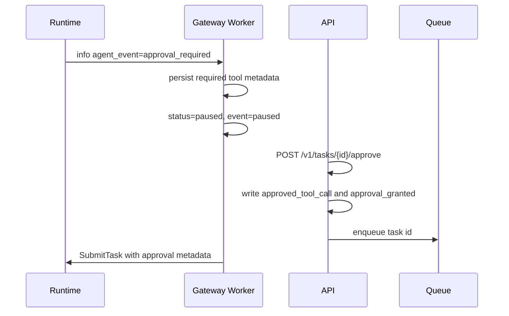

# 功能：Agent 工具治理与审批策略

Agent 工具治理的目标是让 Runtime 可以调用工具，同时保持角色授权、风险审批、禁用策略和审计日志在统一边界内执行。

## 相关实现

| 文件 | 说明 |
|---|---|
| [runtime.py](../services/ai-engine-py/app/runtime.py) | 工具选择、策略判断、审批暂停、执行和标准事件 |
| [base.py](../services/ai-engine-py/app/tools/base.py) | ToolCall、ToolContext、ToolResult、AgentTool 协议 |
| [registry.py](../services/ai-engine-py/app/tools/registry.py) | 工具注册、schema 校验、provider 元数据 |
| [builtin.py](../services/ai-engine-py/app/tools/builtin.py) | 内置工具和 BuiltinToolProvider |
| [policy.py](../services/ai-engine-py/app/tools/policy.py) | 角色授权、审批集合、禁用工具 |
| [audit.py](../services/ai-engine-py/app/tools/audit.py) | JSONL 工具审计日志 |
| [providers.py](../services/ai-engine-py/app/tools/providers.py) | LocalClass、OpenAPI、MCP provider 扩展 |

## 工具协议

所有工具都需要满足 `AgentTool` 协议：

| 字段/方法 | 说明 |
|---|---|
| `name` | 工具名，策略和事件使用该名称 |
| `description` | 工具说明 |
| `input_schema` | 结构化输入 schema |
| `risk_level` | `low`、`medium`、`high`、`critical` |
| `requires_approval` | 是否默认需要审批 |
| `execute(call, context)` | 执行 ToolCall 并返回 ToolResult |

`ToolCall` 同时支持旧的 `input_text` 和新的结构化 `arguments`。工具应优先读取结构化参数，再回退文本输入。

## 内置工具清单

| 工具 | 风险 | 默认审批 | 说明 |
|---|---|---|---|
| `retrieval` | low | 否 | 读取当前任务已召回的长期记忆 |
| `calculator` | low | 否 | 受限数学表达式计算 |
| `browser_fetch` | high | 是 | 抓取 allowlist 内网页 |
| `http_api` | high | 是 | 抓取 allowlist 内 HTTP API |
| `code_exec` | high | 是 | 受限表达式执行，默认禁用执行能力 |
| `json_echo` | low | 否 | 回显结构化调用信息 |
| `search` | medium | 否 | 从查询中产生候选来源 URL |
| `open_url` | high | 是 | 打开 allowlist URL |
| `extract_text` | high | 是 | 提取网页文本 |
| `summarize_page` | high | 是 | 抓取并摘要页面 |
| `source_citation` | low | 否 | 格式化来源引用 |

## 默认角色策略

| 角色 | 默认允许 |
|---|---|
| `admin` | `*` |
| `user` | retrieval、calculator、browser_fetch、http_api、search、open_url、extract_text、summarize_page、source_citation、json_echo |

`code_exec` 不在普通用户默认白名单中。即使 admin 允许工具，若工具需要审批，仍需要满足审批条件。

## 策略配置

通过 `SYNAPSE_AGENT_TOOL_POLICY_JSON` 覆盖策略：

```json
{
  "role_allow": {
    "user": ["retrieval", "calculator", "search"],
    "admin": ["*"]
  },
  "approval_required": ["summarize_page", "http_api", "code_exec"],
  "disabled_tools": ["code_exec"]
}
```

规则：

1. `disabled_tools` 优先级最高。
2. `role_allow` 不存在的角色会回退到 `user`。
3. `approval_required` 覆盖默认审批集合。
4. 当 `SYNAPSE_AGENT_REQUIRE_APPROVAL_FOR_HIGH_RISK=true`，高风险或声明 `requires_approval=true` 的工具会加入默认审批集合。

## 审批模型

旧审批方式：

```text
approved_tools=summarize_page,retrieval
```

新审批方式：

```json
{
  "tool_name": "summarize_page",
  "tool_input": "https://example.com",
  "risk_level": "high",
  "reason": "ops approval",
  "resume_step_index": 1
}
```

新方式通过 `approved_tool_call` 存在任务 metadata 中。Runtime 放行时会匹配：

| 字段 | 作用 |
|---|---|
| `tool_name` | 必须等于当前工具 |
| `tool_input` | 必须和当前工具输入归一化后相同 |
| `risk_level` | 如存在，必须和当前工具风险一致 |
| `resume_step_index` | 如大于 0，必须等于当前执行步点 |

这样可以避免“同名工具换参数”被误放行。

## 审批暂停链路



## 审计日志

配置 `SYNAPSE_AGENT_TOOL_AUDIT_LOG_FILE` 后，Runtime 会写 JSONL：

| 字段 | 说明 |
|---|---|
| `timestamp_unix_ms` | 审计时间 |
| `task_id` | 任务 ID |
| `user_id` | 用户 |
| `user_role` | 角色 |
| `action` | `executed`、`failed`、`blocked`、`approval_required`、`approved` 等 |
| `tool` | 工具名 |
| `tool_input_preview` | 工具输入预览，最多 240 字符 |
| `risk_level` | 风险 |
| `ok` | 是否成功 |
| `outcome` | 结果摘要 |
| `reason` | 原因 |
| `duration_ms` | 耗时 |
| `details` | 结构化细节 |

## Provider 扩展

| Provider | 作用 | 当前状态 |
|---|---|---|
| `LocalClassToolProvider` | 注册本地 Python 工具类或实例 | 可用 |
| `OpenAPIToolProvider` | 从 OpenAPI paths/operationId/parameters/requestBody 发现工具 | 可发现 schema，真实 executor 需注入 |
| `MCPToolProvider` | 将 MCP adapter 工具包装为 AgentTool | adapter 接口已定义，真实 transport 待接 |

扩展 provider 的默认策略通过 `ToolProviderPolicy` 合并到 Runtime 策略中。provider 不能绕过 `ToolPolicy`、审批和审计。

## 外联与执行边界

| 配置 | 建议 |
|---|---|
| `SYNAPSE_AGENT_TOOL_HTTP_ALLOWLIST` | 生产必须配置，仅允许可信域名 |
| `SYNAPSE_AGENT_TOOL_HTTP_TIMEOUT_SECONDS` | 设置有限超时，避免工具长期阻塞 |
| `SYNAPSE_AGENT_ENABLE_CODE_EXECUTION` | 生产默认关闭 |
| `SYNAPSE_AGENT_TOOL_AUDIT_LOG_FILE` | 生产接集中日志系统 |

## 测试覆盖

| 文件 | 覆盖 |
|---|---|
| [test_tools_protocol.py](../services/ai-engine-py/tests/test_tools_protocol.py) | 工具协议、标准事件、审批精确匹配、审计 |
| [test_tool_providers.py](../services/ai-engine-py/tests/test_tool_providers.py) | Local/OpenAPI/MCP provider |
| [cases.json](../services/ai-engine-py/app/benchmarks/cases.json) | calculator、retrieval、browser、approval、code_exec、memory 等回归场景 |

运行：

```powershell
Set-Location services/ai-engine-py
python -m unittest discover -s tests -p "test_*.py"
python -m app.benchmarks.regression
Set-Location ..\..
```

## 当前限制

1. OpenAPI provider 还没有内置真实 HTTP executor。
2. MCP provider 还没有绑定具体 MCP SDK 或 transport。
3. 策略 JSON 目前通过环境变量注入，不适合复杂策略运维。
4. Web 端尚未提供完整工具策略管理 UI。
