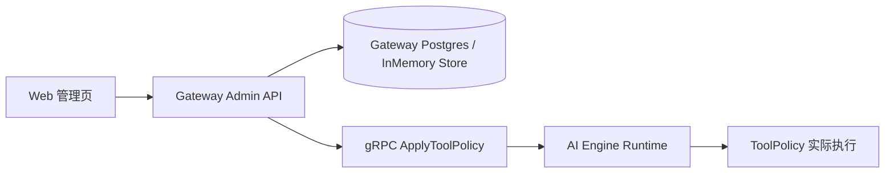

# 工具策略管理中心

工具策略管理中心把原先主要依赖环境变量 JSON 的治理能力，收拢为管理员可查看、可编辑、可热更新的配置面。



## 架构选择

| 组件 | 职责 |
|---|---|
| Gateway | 管理员 HTTP API、权限校验、策略持久化、保存后热下发 |
| AI Engine | 继续作为策略实际执行方，负责运行时授权、审批与禁用判断 |
| Web | 管理员操作台，展示工具目录并编辑策略 |

选择这套边界，是为了避免把执行决策搬离 AI Engine，同时让 Gateway 继续承担“控制面”职责。保存策略时，Gateway 先持久化，再通过 gRPC 调用 AI Engine 的 `ApplyToolPolicy` 进行运行时刷新；Gateway 重启时也会把已保存策略重新下发。Postgres 是正式持久化路径；未配置数据库时会退回内存存储，便于开发，但重启会丢失。

## 策略模型

```json
{
  "role_allow": {
    "user": ["retrieval", "calculator"],
    "admin": ["*"]
  },
  "approval_required": ["browser_fetch"],
  "disabled_tools": ["code_exec"],
  "version": 3,
  "updated_at": "2026-05-15T10:00:00Z",
  "updated_by": "admin",
  "description": "production baseline"
}
```

| 字段 | 说明 |
|---|---|
| `role_allow` | 角色到工具白名单的映射；当前管理页支持 `user`、`admin` |
| `approval_required` | 仍需经过角色授权后，额外要求审批的工具 |
| `disabled_tools` | 全局禁用，优先级最高 |
| `version` | 每次管理端保存自动递增 |
| `updated_at` / `updated_by` | 最近更新时间和更新人 |
| `description` | 策略备注 |

`*` 只允许出现在 `role_allow` 中，表示该角色对当前和未来工具默认放行；它不代表跳过审批，也不代表绕过 `disabled_tools`。

## 与环境变量的关系

优先级固定为：

```text
provider 默认策略 / 内置默认策略
        ↓
SYNAPSE_AGENT_TOOL_POLICY_JSON（启动默认值）
        ↓
Gateway 持久化策略（存在时覆盖，并热更新运行时）
```

也就是说：

1. 没有持久化策略时，AI Engine 继续使用现有 env JSON 逻辑，保持兼容；
2. 一旦管理员在控制台保存策略，持久化策略就成为运行时权威配置；
3. 后续 provider 新增工具若未被显式写入策略：
   - `admin=["*"]` 会继续看到该工具；
   - 其它角色是否可见，取决于对应白名单；
   - 工具自身的默认风险和审批属性仍会被展示在目录中。

## API

| 方法 | 路径 | 说明 | 权限 |
|---|---|---|---|
| `GET` | `/v1/admin/tool-policy` | 查询当前策略；若尚未保存管理策略，则返回运行时默认策略 | admin |
| `PUT` | `/v1/admin/tool-policy` | 全量更新策略并尝试热应用 | admin |
| `POST` | `/v1/admin/tool-policy/reload` | 重新把已保存策略下发给 AI Engine | admin |
| `GET` | `/v1/admin/tools` | 查询当前工具目录与有效状态 | admin |

### `GET /v1/admin/tools` 输出

| 字段 | 说明 |
|---|---|
| `name` | 工具名 |
| `description` | 工具说明 |
| `risk_level` | 风险等级 |
| `requires_approval` | 当前有效策略下是否需要审批 |
| `provider_name` | 工具来源 provider |
| `currently_disabled` | 当前是否被禁用 |
| `allowed_roles` | 当前可使用该工具的角色 |

### 校验与错误

| 场景 | 状态码 | `code` |
|---|---|---|
| 非管理员访问 | `403` | 复用现有权限错误 |
| 请求体结构错误 | `400` | `invalid_request` |
| 策略字段非法 | `400` | `invalid_policy` |
| 出现未知工具名 | `400` | `unknown_tools` |
| 工具目录不可用 | `502` | `tool_catalog_unavailable` |
| 保存成功但运行时热更新失败 | `502` | `runtime_apply_failed` |
| 没有已保存策略却执行 reload | `404` | `tool_policy_not_found` |

当前实现选择“严格拒绝未知工具名”，这样可以阻止管理员误拼写后得到一个表面成功、实际无效的策略。未来若要支持“预留未来工具名”，应显式增加单独的允许模式，而不是默默吞掉未知值。

## Web 交互

管理员页面当前支持：

1. 按 provider、risk level、disabled 状态过滤；
2. 禁用/启用工具；
3. 切换工具是否需要审批；
4. 编辑 `user`、`admin` 的工具白名单；
5. 保存、取消未保存修改、手动 reload；
6. 展示最近更新时间、更新人、策略来源；
7. 对高风险工具做醒目标识，并明确说明“关闭审批”不等于“跳过角色授权”。

## 生效机制

| 场景 | 行为 |
|---|---|
| 首次启动且没有管理策略 | 使用 env JSON 或默认策略 |
| 管理员保存 | Gateway 持久化 -> AI Engine 热更新 |
| Gateway 重启 | 启动时重新下发已保存策略 |
| 管理员手动 reload | 把当前持久化策略再次推送到 AI Engine |

运行时刷新是本版 MVP 的默认路径，不需要重启 AI Engine 才能让新策略影响后续任务执行。

## 使用示例

```powershell
$body = @{
  role_allow = @{
    user = @("retrieval", "calculator")
    admin = @("*")
  }
  approval_required = @("browser_fetch")
  disabled_tools = @("code_exec")
  description = "baseline"
} | ConvertTo-Json -Depth 5

Invoke-RestMethod `
  -Method Put `
  -Uri http://127.0.0.1:8080/v1/admin/tool-policy `
  -ContentType application/json `
  -Body $body `
  -WebSession $session
```

验证一个普通用户是否被限制时，应同时观察两层：

1. 该工具是否在 `role_allow.user` 中；
2. 若工具仍允许执行，它是否又被 `approval_required` 或 `disabled_tools` 进一步收紧。
