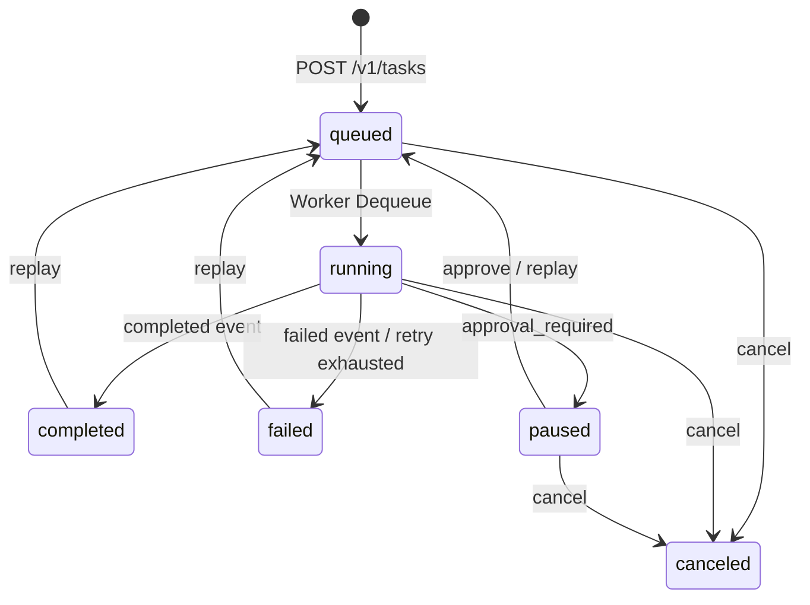
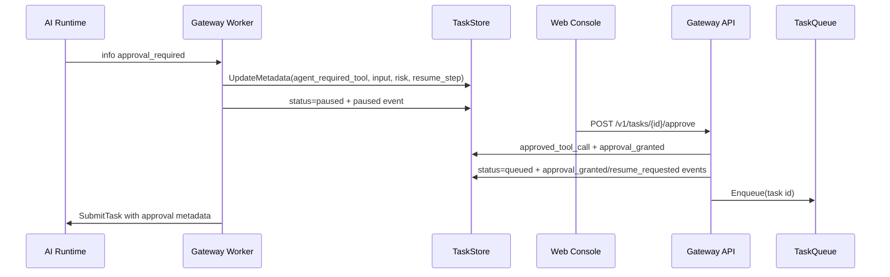

# 后续开发基线与演进建议

> 说明：本文记录的是较早阶段的演进基线，保留用于理解设计来路；当前公开路线图与完成状态请以根 [README.md](../README.md#roadmap) 为准。

本文基于当前仓库代码与既有文档整理后续开发基线，只描述现有实现与可演进方向，不改变运行时行为。

## 1. 当前系统总体架构

Synapse 当前是三运行时协作的 Agent 任务执行平台：

| 运行时 | 路径 | 当前职责 | 关键依据 |
|---|---|---|---|
| Web Console | [apps/web/src/App.tsx](../apps/web/src/App.tsx) | 登录注册、用户会话视图、运维视图、任务创建、SSE 展示、审批恢复、取消、死信重放、Agent 时间线展示 | [doc/30-web模块.md](30-web模块.md) |
| Gateway | [services/gateway-go](../services/gateway-go) | HTTP API、Cookie Session、任务落库、会话上下文构建、队列投递、SSE、Worker、审批恢复、死信 | [doc/12-gateway-api模块.md](12-gateway-api模块.md), [doc/16-gateway-worker模块.md](16-gateway-worker模块.md) |
| AI Engine | [services/ai-engine-py](../services/ai-engine-py) | gRPC Runtime、mock/OpenAI-compatible provider、Agent loop、工具治理、长期记忆、回归评测 | [doc/20-ai-engine模块.md](20-ai-engine模块.md) |
| Proto 契约 | [proto/synapse/v1/agent.proto](../proto/synapse/v1/agent.proto) | `Health`、`SubmitTask` stream、`MemoryWrite`、`MemoryRecall`、`MemoryDelete`、`MemoryList` | [doc/03-协议与通信.md](03-协议与通信.md) |

当前系统的稳定边界是：Web 只调用 Gateway HTTP/SSE；Gateway 不直接调用模型 SDK，而是通过 gRPC 调 AI Engine；AI Engine 内部统一处理模型、Agent loop、工具策略、审批判断和长期记忆。

```mermaid
flowchart TD
    Web[Web Console] -->|HTTP JSON /v1| Gateway[Gateway API]
    Web -->|SSE /v1/tasks/{id}/events| SSE[Gateway SSE]
    Gateway --> Auth[Cookie Session and Role]
    Gateway --> Store[(TaskStore)]
    Gateway --> Queue[(TaskQueue)]
    Queue --> Worker[Gateway Worker]
    Worker -->|SubmitTask gRPC stream| AI[AI Engine Runtime]
    Gateway -->|Memory RPC| AI
    AI --> Model[Mock / OpenAI-compatible]
    AI --> Tools[ToolRegistry / ToolPolicy / Audit]
    AI --> Memory[(FileMemoryStore)]
    Store --> Postgres[(Postgres optional)]
    Queue --> Redis[(Redis List optional)]
```

## 2. Web、Gateway、AI Engine 调用关系

| 链路 | 当前行为 | 关键实现 |
|---|---|---|
| Web -> Gateway HTTP | Vite dev proxy 将 `/v1`、`/healthz` 转发到 `127.0.0.1:8080`；前端用 `requestJson` 统一携带 Cookie | [apps/web/vite.config.ts](../apps/web/vite.config.ts), [apps/web/src/App.tsx](../apps/web/src/App.tsx) |
| Web -> Gateway SSE | 选中任务后连接 `/v1/tasks/{taskID}/events?last_event_id=...`，前端按 `event_id` 去重并拼接 token | [apps/web/src/App.tsx](../apps/web/src/App.tsx), [doc/03-协议与通信.md](03-协议与通信.md) |
| Gateway -> Store/Queue | `CreateTask` 先写 TaskStore，再 `Enqueue` task id；Postgres/Redis 不可用时回退内存实现 | [services/gateway-go/internal/api/handlers.go](../services/gateway-go/internal/api/handlers.go), [services/gateway-go/cmd/server/main.go](../services/gateway-go/cmd/server/main.go) |
| Gateway Worker -> AI Engine | Worker 出队后调用 `agent.SubmitTask`，把 gRPC AgentEvent 转成小写事件并持久化 | [services/gateway-go/internal/worker/processor.go](../services/gateway-go/internal/worker/processor.go) |
| Gateway -> AI Engine Memory RPC | `/v1/memories` 系列接口只做权限和字段转换，真实存储在 AI Engine `MemoryStore` | [services/gateway-go/internal/api/handlers_memory.go](../services/gateway-go/internal/api/handlers_memory.go), [services/ai-engine-py/app/service.py](../services/ai-engine-py/app/service.py) |

## 3. 任务生命周期与事件流

任务状态以 [services/gateway-go/internal/domain/task.go](../services/gateway-go/internal/domain/task.go) 为准：`queued`、`running`、`paused`、`completed`、`failed`、`canceled`。



事件流基线：

1. AI Engine 只通过 gRPC 输出 `started`、`info`、`token`、`completed`、`failed`。
2. Gateway Worker 将事件持久化到 `task_events`，并基于 `info` 中的 `approval_required` 派生 `paused`。
3. Gateway API 在审批、取消、重放、死信路径写入 `approval_granted`、`resume_requested`、`cancel_requested`、`canceled`、`dead_lettered`、`replay_requested`。
4. SSE 层按 `last_event_id` 从 TaskStore 增量读取事件；终态无新事件时发送不入库的 `terminal`。

这一设计说明“任务执行结果”和“前端实时展示”都以持久化事件为中心，后续 Trace、Replay Diff、审计报表都应优先复用 `task_events`，而不是另建一条并行日志链路。

## 4. 审批暂停与恢复链路

高风险工具审批目前已经打通精确工具调用恢复链路：



关键约定：

| 字段 | 写入方 | 用途 |
|---|---|---|
| `approval_required` | AI Engine info 事件 | 通知 Worker 当前工具调用需要人工审批 |
| `agent_required_tool` / `agent_required_tool_input` / `agent_required_tool_risk_level` | Worker | 为 Web 和 API 恢复审批上下文 |
| `approved_tool_call` | Gateway API | 精确绑定工具名、输入、风险和恢复步点 |
| `agent_resume_step_index` | Worker/API | 指示 Runtime 从哪个步骤继续 |

当前代码中 `approval_granted` 只是恢复任务标记；AI Engine 真正放行高风险工具时会匹配 `approved_tool_call` 或旧版 `approved_tools`，避免只靠布尔值放行。依据见 [services/ai-engine-py/app/runtime.py](../services/ai-engine-py/app/runtime.py) 中 `_is_tool_call_approved` 和 [services/gateway-go/internal/api/handlers.go](../services/gateway-go/internal/api/handlers.go) 中 `ApproveTask`。

## 5. 工具治理链路

AI Engine 侧已经形成统一工具治理边界：

| 层次 | 关键对象 | 当前职责 |
|---|---|---|
| 工具协议 | `ToolCall`、`ToolContext`、`ToolResult`、`AgentTool` | 标准化工具输入、上下文、输出和错误结构 |
| 工具注册 | `ToolRegistry` | 注册工具、校验 schema、保留 provider 元数据 |
| 策略 | `ToolPolicy` | 角色授权、审批集合、禁用工具 |
| 审计 | `ToolAuditLogger` | 写入 JSONL 工具审计日志 |
| 来源扩展 | `BuiltinToolProvider`、`LocalClassToolProvider`、`OpenAPIToolProvider`、`MCPToolProvider` | 把不同来源工具接入同一治理路径 |

当前工具 provider 不能绕过治理：`AgentRuntime.__init__` 先注册 provider 发现到的工具，再把 provider 默认策略合并到 `ToolPolicy`，实际执行前仍统一做角色、审批和审计判断。依据见 [services/ai-engine-py/app/runtime.py](../services/ai-engine-py/app/runtime.py)、[services/ai-engine-py/app/tools/registry.py](../services/ai-engine-py/app/tools/registry.py)、[services/ai-engine-py/app/tools/providers.py](../services/ai-engine-py/app/tools/providers.py)。

## 6. 长期记忆当前实现

长期记忆现在是 AI Engine 内部文件后端，Gateway 只做 HTTP 到 gRPC 的转发。

| 能力 | 当前实现 | 依据 |
|---|---|---|
| 自动召回 | `AgentRuntime.run_task` 开始时调用 `memory_recall`，并输出 `memory_recall` info 事件 | [services/ai-engine-py/app/runtime.py](../services/ai-engine-py/app/runtime.py) |
| 自动写入 | 任务结束后按 `memory_write_enabled` 写入 `MemoryRecord`，并输出 `memory_write` info 事件 | [services/ai-engine-py/app/runtime.py](../services/ai-engine-py/app/runtime.py) |
| 手工管理 | Gateway 暴露 `GET/POST/DELETE /v1/memories` 和 `GET /v1/memories/recall` | [services/gateway-go/internal/api/handlers_memory.go](../services/gateway-go/internal/api/handlers_memory.go) |
| 存储格式 | JSON 文件，按 user_id 分桶，记录 `memory_id/content/summary/source_task_id/importance/created_at` | [services/ai-engine-py/app/memory.py](../services/ai-engine-py/app/memory.py) |
| 召回算法 | 关键词匹配 + importance 加权；无关键词命中时回退最近记忆 | [services/ai-engine-py/app/memory.py](../services/ai-engine-py/app/memory.py), [doc/04-数据库与存储.md](04-数据库与存储.md) |

结论：长期记忆 API 和 Runtime 接入已经存在，但目前不是向量召回，也没有 Web 记忆管理页面。

## 7. 已预留但还未完成的能力

| 能力 | 当前状态判断 | 代码或文档依据 |
|---|---|---|
| MCP 真接入 | 已有 `MCPAdapter` 和 `MCPToolProvider` 壳，但没有绑定具体 MCP SDK、进程管理、鉴权或 transport | [services/ai-engine-py/app/tools/providers.py](../services/ai-engine-py/app/tools/providers.py), [doc/45-功能-Agent工具治理与审批策略.md](45-功能-Agent工具治理与审批策略.md) |
| OpenAPI 真实执行器 | `OpenAPIToolProvider` 可从 spec 发现工具和 schema；`OpenAPITool.execute` 在缺少 executor 时返回 `openapi_executor_missing` | [services/ai-engine-py/app/tools/providers.py](../services/ai-engine-py/app/tools/providers.py), [services/ai-engine-py/tests/test_tool_providers.py](../services/ai-engine-py/tests/test_tool_providers.py) |
| 向量记忆 | `VectorMemoryStore` 方法全部抛 `NotImplementedError`，当前 `FileMemoryStore` 是关键词召回 | [services/ai-engine-py/app/memory.py](../services/ai-engine-py/app/memory.py), [doc/04-数据库与存储.md](04-数据库与存储.md) |
| 记忆管理 UI | Gateway 已有记忆 API，Web 文档明确当前没有完整记忆管理页面；`App.tsx` 只展示 `memory_recall` 事件和 `memory_write_enabled` 开关 | [doc/30-web模块.md](30-web模块.md), [apps/web/src/App.tsx](../apps/web/src/App.tsx) |
| 工具策略管理中心 | 策略现在通过 `SYNAPSE_AGENT_TOOL_POLICY_JSON` 环境变量注入，没有数据库模型和 Web 管理面 | [services/ai-engine-py/app/config.py](../services/ai-engine-py/app/config.py), [doc/45-功能-Agent工具治理与审批策略.md](45-功能-Agent工具治理与审批策略.md) |
| Agent Trace 工作台 | Web 已能从 info 事件构建 Agent 时间线，但没有独立 Trace 查询、过滤、对比和审计工作台 | [apps/web/src/App.tsx](../apps/web/src/App.tsx), [doc/30-web模块.md](30-web模块.md) |
| 真实模型 Benchmark | 回归评测当前用 `model_provider="mock"` 和本地 seed memory，`cases.json` 是稳定 mock 用例；没有真实 provider 成本、延迟、质量基准 | [services/ai-engine-py/app/benchmarks/regression.py](../services/ai-engine-py/app/benchmarks/regression.py), [doc/46-功能-Agent回归评测与门禁.md](46-功能-Agent回归评测与门禁.md) |
| Replay Diff | 当前只有 `/replay` 将非 running 任务重置为 queued 并追加 `replay_requested`；仓库内未发现 diff/compare 实现 | [services/gateway-go/internal/api/handlers.go](../services/gateway-go/internal/api/handlers.go), [doc/43-功能-重试死信与重放.md](43-功能-重试死信与重放.md) |
| Web 工程化拆分 | `App.tsx` 承担类型、API、状态、SSE、聊天、运维、时间线和表单；文档也将“大文件”列为限制 | [apps/web/src/App.tsx](../apps/web/src/App.tsx), [doc/30-web模块.md](30-web模块.md) |
| OpenAPI/Swagger 文档 | 根 README 和 Gateway API 文档都明确当前没有 OpenAPI/Swagger/Apifox/Postman | [README.md](../README.md), [doc/12-gateway-api模块.md](12-gateway-api模块.md) |

## 8. 最适合继续扩展的模块

| 模块 | 适合扩展原因 | 建议边界 |
|---|---|---|
| [services/ai-engine-py/app/tools/providers.py](../services/ai-engine-py/app/tools/providers.py) | Local/OpenAPI/MCP provider 抽象已存在，适合补真实外部工具生态 | provider 只负责发现和适配工具，不能绕过 `ToolPolicy`、审批和审计 |
| [services/ai-engine-py/app/memory.py](../services/ai-engine-py/app/memory.py) | `MemoryStore` 协议稳定，`VectorMemoryStore` 已预留接口骨架 | 向量召回应保持 `MemoryRecord`/`MemoryRecallHit` 外部契约不变 |
| [services/gateway-go/internal/api/handlers_memory.go](../services/gateway-go/internal/api/handlers_memory.go) | 记忆管理 HTTP API 已完整转发，适合被 Web UI 直接复用 | 不要把记忆存储逻辑搬到 Gateway；Gateway 继续做权限和转发 |
| [services/gateway-go/internal/worker/processor.go](../services/gateway-go/internal/worker/processor.go) | 事件持久化、暂停、重试、死信都在这里收口 | 新事件必须保持 SSE 和任务状态机一致 |
| [apps/web/src/App.tsx](../apps/web/src/App.tsx) | 已有所有用户路径，适合先拆出 `api`、`hooks`、`components` 后再加新工作台 | 先拆分再加复杂页面，避免继续扩大单文件状态耦合 |
| [services/ai-engine-py/app/benchmarks](../services/ai-engine-py/app/benchmarks) | mock 回归门禁已经存在，适合扩展真实模型 benchmark 和 replay diff 验收 | 保留 mock regression 作为快速门禁，真实 benchmark 单独分层 |

## 9. 后续开发顺序

| 优先级 | 建议任务 | 理由 |
|---|---|---|
| P0 | Web 工程化拆分、记忆管理 UI、Agent Trace 工作台 MVP | 这些任务主要复用已有 API 和事件，不需要先改 proto；能显著提升可调试性和后续开发效率 |
| P0 | README 与 Demo 包装 | 当前功能已经较完整，但新用户入口仍分散；Demo 包装能降低验收和展示成本 |
| P1 | OpenAPI 真实执行器、MCP 真接入、工具策略管理中心 | 这是工具生态的主线，需要基于现有 ToolProvider/ToolPolicy 扩展，涉及安全边界，应在 UI/Trace 可观察后推进 |
| P1 | Replay Diff | 依赖稳定事件归档和 Trace 展示，适合在 Trace MVP 后做 |
| P2 | 向量记忆、真实模型 Benchmark | 需要额外存储、索引、模型凭据、成本统计和更强运维策略，适合作为第二阶段 |
| P2 | 队列可靠性、migration、生产安全 | 属于生产化底座，和功能演示路径可并行规划，但会牵涉部署策略和数据迁移 |

## 10. MVP 与第二阶段

| 能力 | MVP 建议 | 第二阶段建议 |
|---|---|---|
| 记忆管理 | 先做列表、召回、手工写入、删除，复用 `/v1/memories` | 再做标签、重要性编辑、批量清理、向量召回解释 |
| Agent Trace | 先基于 task events 展示阶段、工具、审批、记忆、最终回答 | 再做跨任务搜索、耗时统计、导出、Replay Diff |
| 工具策略 | 先做只读策略查看和环境变量 JSON 校验辅助 | 再做数据库策略、发布审批、灰度和审计报表 |
| OpenAPI 工具 | 先接一个受控 executor：allowlist host、GET/POST JSON、固定 auth 配置 | 再做 OAuth、复杂参数序列化、响应 schema 映射 |
| MCP 工具 | 先接本地 stdio/server 白名单和工具发现 | 再做多租户 MCP、远程 transport、凭据隔离 |
| Benchmark | 先保留 mock regression 为必跑门禁 | 再引入真实 provider 分层 benchmark、成本和延迟指标 |
